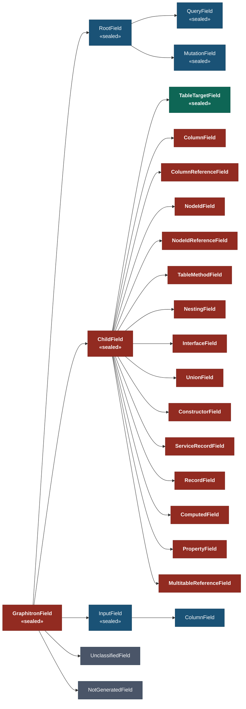
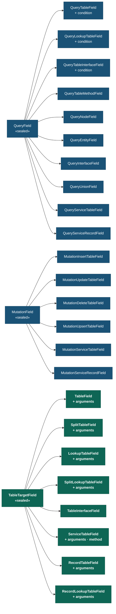
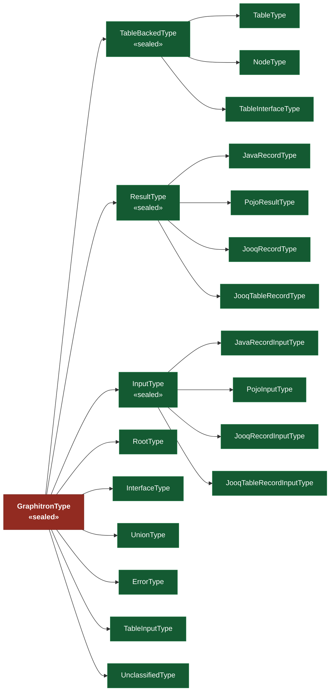
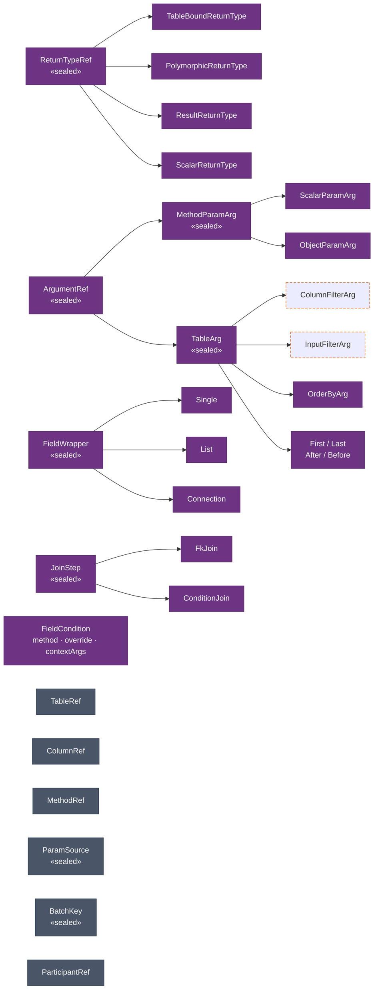

# Rewrite Model — Visual Reference

Colour legend:

| Symbol | Meaning |
|---|---|
| 🔴 Red / bold | Core sealed interfaces — structural backbone |
| 🟢 Teal | `TableTargetField` group — primary SQL-generation abstraction |
| 🔵 Blue | `QueryField` / `MutationField` — entry-point fields on root types |
| 🟩 Green | `GraphitronType` variants |
| 🟣 Purple | Support / composition types |
| ⚫ Dark grey | Value / leaf types — stable, rarely changed |
| 🟠 Orange dashed border | Model gap — not yet modelled |

---

## 1. Field Hierarchy

---

## 2. Root Field Variants

All `TableTargetField` variants carry `returnType · joinPath · condition`.
`QueryTableField`, `QueryLookupTableField`, and `QueryTableInterfaceField` carry `returnType · condition · arguments` (no `joinPath` — no parent table to navigate from).

---

## 3. Type Hierarchy

---

## 4. Support / Composition Types

`ColumnFilterArg` and `InputFilterArg` are shown with orange dashed borders — they are missing a `FieldCondition condition` component for `@condition` on `ARGUMENT_DEFINITION`.

---

## 5. Key Compositions (HAS-A)

| Holder | Field | Type |
|---|---|---|
| `TableTargetField` | `returnType` | `TableBoundReturnType` |
| `TableTargetField` | `joinPath` | `List<JoinStep>` |
| `TableTargetField` | `condition` | `FieldCondition?` |
| `TableTargetField` | `arguments` | `List<ArgumentRef>` |
| `QueryTableField` / `QueryLookupTableField` / `QueryTableInterfaceField` | `condition` | `FieldCondition?` |
| `TableBoundReturnType` | `table` | `TableRef` |
| `TableBackedType` | `table` | `TableRef` |
| `TableRef` | `primaryKey?` | `List<ColumnRef>?` |
| `FieldCondition` | `method` | `MethodRef` — signature: `(Table tgt, Arg...)` |
| `FkJoin` | `whereFilter?` | `MethodRef?` — signature: `(SourceTable src, Table tgt)` |
| `ConditionJoin` | `condition` | `MethodRef` — signature: `(SourceTable src, Table tgt)` |
| `QueryServiceTableField` | `method` | `MethodRef` |
| `MutationServiceTableField` | `method` | `MethodRef` |
| `ServiceTableField` (child) | `method` | `MethodRef` |

---

## Notes on potential cleanup

### Structural redundancy in `TableTargetField`

`TableField`, `SplitTableField`, `LookupTableField`, `SplitLookupTableField`, `RecordTableField`,
and `RecordLookupTableField` all share the same component set
(`returnType · joinPath · condition · arguments`). The only classifying difference is:

| Type | Parent context | Split query | Lookup key |
|---|---|---|---|
| `TableField` | table-mapped | ✗ | ✗ |
| `SplitTableField` | table-mapped | ✓ | ✗ |
| `LookupTableField` | table-mapped | ✗ | ✓ |
| `SplitLookupTableField` | table-mapped | ✓ | ✓ |
| `RecordTableField` | result-mapped | ✗ | ✗ |
| `RecordLookupTableField` | result-mapped | — | ✓ |

These could potentially be collapsed into fewer types with boolean flags, or further intermediate
sealed interfaces (e.g., `StandardTableField permits TableField, SplitTableField`,
`RecordBoundField permits RecordTableField, RecordLookupTableField`).

### `QueryField` mirrors `ChildField`

Several `QueryField` variants structurally mirror their `ChildField` counterparts:

| `QueryField` | `ChildField` counterpart |
|---|---|
| `QueryTableField` | `TableField` / `SplitTableField` |
| `QueryLookupTableField` | `LookupTableField` / `SplitLookupTableField` |
| `QueryTableInterfaceField` | `TableInterfaceField` |
| `QueryServiceTableField` | `ServiceTableField` |
| `QueryServiceRecordField` | `ServiceRecordField` |

The only structural difference is that root fields have no `joinPath` — there is no parent table
to FK-navigate from. `QueryTableField`, `QueryLookupTableField`, and `QueryTableInterfaceField`
now carry `FieldCondition condition` alongside their `ChildField` counterparts.
`QueryTableMethodTableField` and `QueryServiceTableField` intentionally do not carry condition —
the developer-controlled method/service replaces SQL generation entirely.

Whether a shared interface between root and child table-bound fields could capture the common
parts (`returnType · condition · arguments`) is worth exploring.

### `TableTargetField` interface vs. `NestingField`

`NestingField` carries `ReturnTypeRef.TableBoundReturnType` but is intentionally excluded from
`TableTargetField` because it does not navigate to a new table scope. This exclusion is
architecturally correct but worth documenting clearly at the use sites.

### `ConditionJoin` vs. `FkJoin.whereFilter` vs. `FieldCondition`

All three hold a `MethodRef`, which is intentional: `MethodRef` is the general model-level
representation of any user-provided Java method (the javadoc says so explicitly). What varies is
the calling convention, and that is already encoded per-parameter in `MethodRef.Param.source`
via `ParamSource`:

| Use site | `ParamSource` sequence | Generated call |
|---|---|---|
| `ConditionJoin.condition` | `SourceTable`, `Table` | `method(srcAlias, tgtAlias)` → ON clause |
| `FkJoin.whereFilter` | `SourceTable`, `Table` | `method(srcAlias, tgtAlias)` → WHERE clause |
| `FieldCondition.method` | `Table`, then `Arg`/`Context`... | `method(tgtTable, arg1, ...)` → WHERE predicate |

The interesting structural observation is that `ConditionJoin.condition` and `FkJoin.whereFilter`
share an identical calling convention (`SourceTable, Table → Condition`), while
`FieldCondition.method` is structurally different (`Table, Arg... → Condition`). The model does
not express this grouping. A potential improvement: introduce a `JoinConditionRef` wrapper used
in both join-step types to make the shared `(source, target)` contract explicit in the type system
and separate it cleanly from the field-condition contract.
