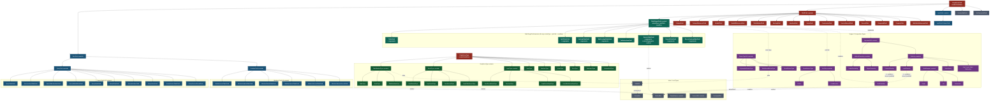

# Rewrite Model — Visual Reference

Colour legend:

| Colour | Meaning |
|---|---|
| 🔴 Red | Core sealed interfaces — structural backbone |
| 🟢 Teal | `TableTargetField` group — primary SQL-generation abstraction, current focus |
| 🔵 Blue | `QueryField` / `MutationField` — entry-point fields on root types |
| 🟣 Purple | Support / composition types — shared across field and type hierarchy |
| ⚫ Dark grey | Value / leaf types — stable, rarely changed |
| 🟠 Orange dashed | Model gap — not yet modelled |

---

```mermaid
graph TD
    classDef core     fill:#922B21,stroke:#7B241C,color:#fff,font-weight:bold
    classDef ttf      fill:#0E6655,stroke:#0A5344,color:#fff,font-weight:bold
    classDef rootf    fill:#1A5276,stroke:#154360,color:#fff
    classDef typeh    fill:#145A32,stroke:#196F3D,color:#fff
    classDef sup      fill:#6C3483,stroke:#5B2C6F,color:#fff
    classDef val      fill:#4A5568,stroke:#2C3E50,color:#fff
    classDef gap      fill:#BA4A00,stroke:#D35400,color:#fff,stroke-dasharray:5 3

    %% ================================================================
    %% SEALED ROOTS
    %% ================================================================
    GF["GraphitronField\n«sealed interface»"]:::core
    GT["GraphitronType\n«sealed interface»"]:::core

    %% ================================================================
    %% FIELD HIERARCHY
    %% ================================================================
    GF --> RF["RootField «sealed»"]:::rootf
    GF --> CF["ChildField «sealed»"]:::core
    GF --> INPF["InputField «sealed»"]:::rootf
    GF --> UNF["UnclassifiedField"]:::val
    GF --> NGF["NotGeneratedField"]:::val

    RF --> QF["QueryField «sealed»"]:::rootf
    RF --> MF["MutationField «sealed»"]:::rootf

    subgraph QFG ["Query Fields  (10 variants)"]
        QTF["QueryTableField"]:::rootf
        QLF["QueryLookupTableField"]:::rootf
        QTI["QueryTableInterfaceField"]:::rootf
        QTMF["QueryTableMethodField"]:::rootf
        QNF["QueryNodeField"]:::rootf
        QEF["QueryEntityField"]:::rootf
        QIF["QueryInterfaceField"]:::rootf
        QUF["QueryUnionField"]:::rootf
        QSTF["QueryServiceTableField"]:::rootf
        QSRF["QueryServiceRecordField"]:::rootf
    end
    QF --> QTF & QLF & QTI & QTMF & QNF & QEF & QIF & QUF & QSTF & QSRF

    subgraph MFG ["Mutation Fields  (6 variants)"]
        MIF["MutationInsertTableField"]:::rootf
        MUF["MutationUpdateTableField"]:::rootf
        MDF["MutationDeleteTableField"]:::rootf
        MUpF["MutationUpsertTableField"]:::rootf
        MSTF["MutationServiceTableField"]:::rootf
        MSRF["MutationServiceRecordField"]:::rootf
    end
    MF --> MIF & MUF & MDF & MUpF & MSTF & MSRF

    %% ---- ChildField direct variants ----
    CF --> TTF["TableTargetField «sealed»\nreturnType · joinPath · condition"]:::ttf
    CF --> ColF["ColumnField"]:::core
    CF --> CRF["ColumnReferenceField"]:::core
    CF --> NIF["NodeIdField"]:::core
    CF --> NIRF["NodeIdReferenceField"]:::core
    CF --> TMF["TableMethodField"]:::core
    CF --> NstF["NestingField"]:::core
    CF --> IFld["InterfaceField"]:::core
    CF --> UnFld["UnionField"]:::core
    CF --> CnsF["ConstructorField"]:::core
    CF --> SvcRF["ServiceRecordField"]:::core
    CF --> RecF["RecordField"]:::core
    CF --> CmpF["ComputedField"]:::core
    CF --> PropF["PropertyField"]:::core
    CF --> MtRF["MultitableReferenceField"]:::core

    subgraph TTG ["TableTargetField variants  (all carry returnType · joinPath · condition)"]
        TF["TableField\n+ arguments"]:::ttf
        STF["SplitTableField\n+ arguments"]:::ttf
        LF["LookupTableField\n+ arguments"]:::ttf
        SLF["SplitLookupTableField\n+ arguments"]:::ttf
        TIF["TableInterfaceField"]:::ttf
        SVCTF["ServiceTableField\n+ arguments · contextArguments · method"]:::ttf
        RTF["RecordTableField\n+ arguments"]:::ttf
        RLF["RecordLookupTableField\n+ arguments"]:::ttf
    end
    TTF --> TF & STF & LF & SLF & TIF & SVCTF & RTF & RLF

    INPF --> InpCF["InputField.ColumnField"]:::rootf

    %% ================================================================
    %% TYPE HIERARCHY
    %% ================================================================
    subgraph TypeG ["GraphitronType variants"]
        TBT["TableBackedType «sealed»"]:::typeh
        ResT["ResultType «sealed»"]:::typeh
        InpT["InputType «sealed»"]:::typeh

        TT["TableType"]:::typeh
        NT["NodeType"]:::typeh
        TIT["TableInterfaceType"]:::typeh

        JRT["JavaRecordType"]:::typeh
        PRT["PojoResultType"]:::typeh
        JRRT["JooqRecordType"]:::typeh
        JTRT["JooqTableRecordType"]:::typeh

        JRIT["JavaRecordInputType"]:::typeh
        PIT["PojoInputType"]:::typeh
        JooqRI["JooqRecordInputType"]:::typeh
        JTRIT["JooqTableRecordInputType"]:::typeh

        RootT["RootType"]:::typeh
        IntT["InterfaceType"]:::typeh
        UnT["UnionType"]:::typeh
        ErrT["ErrorType"]:::typeh
        TInpT["TableInputType"]:::typeh
        UncT["UnclassifiedType"]:::typeh
    end
    GT --> TBT & ResT & InpT & RootT & IntT & UnT & ErrT & TInpT & UncT
    TBT --> TT & NT & TIT
    ResT --> JRT & PRT & JRRT & JTRT
    InpT --> JRIT & PIT & JooqRI & JTRIT

    %% ================================================================
    %% SUPPORT TYPES
    %% ================================================================
    subgraph SupG ["Support / Composition Types"]
        RTR["ReturnTypeRef «sealed»"]:::sup
        TBRT["TableBoundReturnType"]:::sup
        PolRT["PolymorphicReturnType"]:::sup
        ResRTR["ResultReturnType"]:::sup
        ScRTR["ScalarReturnType"]:::sup

        AR["ArgumentRef «sealed»"]:::sup
        MPA["MethodParamArg «sealed»"]:::sup
        TA["TableArg «sealed»"]:::sup
        SPA["ScalarParamArg"]:::sup
        OPA["ObjectParamArg"]:::sup
        CFA["ColumnFilterArg"]:::sup
        IFA["InputFilterArg"]:::sup
        OBA["OrderByArg"]:::sup
        PagA["First / Last / After / BeforeArg"]:::sup

        FW["FieldWrapper «sealed»"]:::sup
        SFW["Single"]:::sup
        LFW["List"]:::sup
        CFW["Connection"]:::sup

        JS["JoinStep «sealed»"]:::sup
        FKJ["FkJoin"]:::sup
        CJ["ConditionJoin"]:::sup

        FC["FieldCondition"]:::sup
    end
    RTR --> TBRT & PolRT & ResRTR & ScRTR
    AR --> MPA & TA
    MPA --> SPA & OPA
    TA --> CFA & IFA & OBA & PagA
    FW --> SFW & LFW & CFW
    JS --> FKJ & CJ

    %% ================================================================
    %% VALUE / LEAF TYPES
    %% ================================================================
    subgraph ValG ["Value / Leaf Types"]
        TR["TableRef"]:::val
        CR["ColumnRef"]:::val
        MR["MethodRef"]:::val
        PS["ParamSource «sealed»"]:::val
        SR["SourcesRef «sealed»"]:::val
        PR["ParticipantRef"]:::val
    end

    %% ================================================================
    %% KEY COMPOSITIONS  (dashed arrows = HAS-A)
    %% ================================================================
    TTF -. "returnType" .-> TBRT
    TTF -. "joinPath" .-> JS
    TTF -. "condition" .-> FC
    TTF -. "arguments" .-> AR

    TBRT  -. "table" .-> TR
    TBT   -. "table" .-> TR
    TR    -. "primaryKey?" .-> CR

    FC    -. "method" .-> MR
    FKJ   -. "whereFilter?" .-> MR
    CJ    -. "condition" .-> MR

    QSTF  -. "method" .-> MR
    MSTF  -. "method" .-> MR
    SVCTF -. "method" .-> MR

    %% ================================================================
    %% MODEL GAPS  (orange dashed = not yet modelled)
    %% ================================================================
    CFA -. "⚠ condition\nnot yet modelled" .-> FC
    IFA -. "⚠ condition\nnot yet modelled" .-> FC

    style CFA stroke:#D35400,stroke-dasharray:5 3
    style IFA stroke:#D35400,stroke-dasharray:5 3
```

---

## Notes on potential cleanup

### Structural redundancy in `TableTargetField`

`TableField`, `SplitTableField`, `LookupTableField`, `SplitLookupTableField`, `RecordTableField`,
and `RecordLookupTableField` all share the same component set
(`returnType · joinPath · condition · arguments`). The only classifying difference is:

| Type | Parent context | Split query | Lookup key |
|---|---|---|---|
| `TableField` | table-mapped | ✗ | ✗ |
| `SplitTableField` | table-mapped | ✓ | ✗ |
| `LookupTableField` | table-mapped | ✗ | ✓ |
| `SplitLookupTableField` | table-mapped | ✓ | ✓ |
| `RecordTableField` | result-mapped | ✗ | ✗ |
| `RecordLookupTableField` | result-mapped | — | ✓ |

These could potentially be collapsed into fewer types with boolean flags, or further intermediate
sealed interfaces (e.g., `StandardTableField permits TableField, SplitTableField`,
`RecordBoundField permits RecordTableField, RecordLookupTableField`).

### `QueryField` mirrors `ChildField`

Several `QueryField` variants structurally mirror their `ChildField` counterparts:

| `QueryField` | `ChildField` counterpart |
|---|---|
| `QueryTableField` | `TableField` / `SplitTableField` |
| `QueryLookupTableField` | `LookupTableField` / `SplitLookupTableField` |
| `QueryTableInterfaceField` | `TableInterfaceField` |
| `QueryServiceTableField` | `ServiceTableField` |
| `QueryServiceRecordField` | `ServiceRecordField` |

The key differences are: root fields have no `joinPath` (no FK navigation from a parent) and no
`condition` (field-level condition applies to the whole query, not a child JOIN). Whether a shared
interface could capture the common parts is worth exploring.

### `TableTargetField` interface vs. `NestingField`

`NestingField` carries `ReturnTypeRef.TableBoundReturnType` but is intentionally excluded from
`TableTargetField` because it does not navigate to a new table scope. This exclusion is
architecturally correct but worth documenting clearly at the use sites.

### `ConditionJoin` vs. field-level `FieldCondition`

Both `ConditionJoin.condition` and `FieldCondition.method` hold a `MethodRef`, but they serve
completely different purposes: join-step conditions are ON-clause structural joins between two
table aliases; `FieldCondition` is a WHERE predicate on the target table. They share the same
value type by coincidence, not by design.
