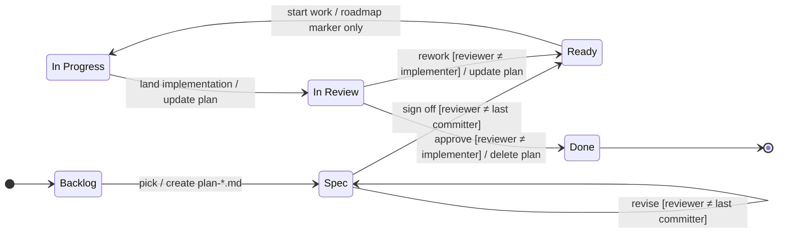

# Development Workflow

Every code change in this repo moves through a fixed pipeline. The roadmap
(`planning/rewrite-roadmap.md`) is the single ledger that tracks state per item.

## States and transitions

**Reviewer rule:** the guards on `Spec → Ready` and `In Review → Done` require a
different party from the one who last changed the artifact. In Claude Code sessions,
the human user is the usual reviewer; an independent agent session (no prior context
on the work) can also serve. A reviewer who lands substantive edits disqualifies
themselves from approving that revision — another party must sign off.

## Plan file conventions

- Location: `planning/plan-<slug>.md`. Slug describes the work, not the
  phase (`plan-variant-coverage-meta-test.md`, not `plan-phase-2.md`).
- First non-heading line is the status front-matter, verbatim:
  `> **Status:** Spec | Ready | In Review`
- Plans may be multi-phase. When a phase ships, the implementation commit updates
  the plan to mark that phase done (typically by collapsing its section into a
  one-line "shipped at `<sha>`" note and capturing any learnings). The overall
  plan's status tracks what's next — if more phases remain, status stays `Ready`;
  if only the just-shipped phase is pending review, status is `In Review`.
- Plans describe *what* to do, not *how many commits* to land it in. Implementation
  commit structure is the implementer's judgment — split when the seams add review
  value, keep unified when they don't.
- Default plan shape is flat sections (`## Implementation`, `## Tests`, `## Roadmap
  entries`), not numbered steps. Reach for "Step 1, Step 2, ..." only when the
  numbering reflects a real seam: separate PRs, a feature-flagged rollout, or
  sequencing where intermediate states are observable. If every step has to land
  before the next one compiles, the numbering is bookkeeping; collapse to a flat
  file-by-file list under `## Implementation` so the actual diff shape is obvious.
  Numbering implies "stop and verify between steps" — don't imply it when there's
  nothing to verify between them.
- A plan deleted on Done has its file removed outright. Git history preserves it;
  leaving a tombstone file encourages staleness.

## Roadmap conventions

Each roadmap item gets a status suffix and, if a plan exists, a link:

- `- **Title** **[Ready]** — description ([plan-slug.md](plan-slug.md))`
- `- **Title** **[Backlog]**`

Use `[Done]` only for milestones worth keeping as history (e.g. "Sealed-switch
dispatch landed at `3357928`"); routine completions disappear entirely.

The roadmap is the source of truth for state. A plan file's status front-matter
mirrors the roadmap; drift is caught because both move together in the same commit.

## Publishing

"Publish" = commit + push. A change that lives only in your working copy doesn't
exist for the rest of the workflow. The trunk-push rule from `CLAUDE.md` applies:
any push to your branch must be followed by a fast-forward to
`claude/graphitron-rewrite`.

## Adding to the roadmap

Any session can add items to the roadmap at any time. Opportunities spotted during
review, implementation, or unrelated work all land here as `[Backlog]` items. The
expectation is that they're substantive enough to justify eventual planning — not
every passing thought.

## Canonical path

Taking a feature from idea to Done. Minimum four commits by at least two parties;
typical paths are five to six when reviews involve iteration:

1. **Author** picks a `[Backlog]` item, drafts `planning/plan-foo.md`, sets
   roadmap to `[Spec]`.
2. **Reviewer (≠ author)** reads the plan, revises if needed (stays `[Spec]`),
   then signs off (`[Ready]`).
3. **Implementer** writes code, updates the plan (remove shipped, keep pending),
   sets roadmap to `[In Review]`.
4. **Reviewer (≠ implementer)** approves (`[Done]`, plan deleted) or requests more
   work (`[Ready]`, new cycle).
