# Development Workflow

Every code change in this repo moves through a fixed pipeline. Each item has
its own file under [`graphitron-rewrite/roadmap/`](../roadmap/), with YAML
front-matter naming its current `status:`. The rolled-up
[`roadmap/README.md`](../roadmap/README.md) is generated from those files by
[`graphitron-roadmap-tool`](../roadmap-tool/) and never edited by hand.

## States and transitions

```mermaid
stateDiagram-v2
    direction LR
    state "In Progress" as InProgress
    state "In Review" as InReview
    [*] --> Backlog
    Backlog --> Spec        : pick / draft plan; status: Spec
    Spec --> Spec           : revise [reviewer ≠ last committer]
    Spec --> Ready          : sign off [reviewer ≠ last committer]
    Ready --> InProgress    : start work; status: In Progress
    InProgress --> InReview : land implementation; status: In Review
    InReview --> Ready      : rework [reviewer ≠ implementer]
    InReview --> Done       : approve [reviewer ≠ implementer] / delete file
    Done --> [*]
```



**Reviewer rule:** the guards on `Spec → Ready` and `In Review → Done` require a
different party from the one who last changed the artifact. In Claude Code sessions,
the human user is the usual reviewer; an independent agent session (no prior context
on the work) can also serve. A reviewer who lands substantive edits disqualifies
themselves from approving that revision — another party must sign off.

## Item file conventions

- Location: `graphitron-rewrite/roadmap/<slug>.md`. Slug describes the work,
  not the phase (`variant-coverage-meta-test.md`, not `phase-2.md`).
  No `plan-` prefix; backlog items live in the same directory and use the
  same shape.
- Each item carries an `id:` of the form `R<n>` (literal `R` plus a positive
  integer). IDs are monotonic across the whole roadmap and **never reused**:
  when an item ships and its file is deleted on Done, the number stays a gap
  so historical references in `changelog.md` and commit messages keep their
  meaning. Refer to items by `R<n>` (or `R<n>: <slug>` when slug context helps);
  the rendered README shows the ID in a leading column.
- First lines are YAML front-matter, delimited by `---`:

  ```yaml
  ---
  id: R<n>                                  # allocated by `roadmap-tool create`
  title: "Human-readable title"
  status: Backlog | Spec | Ready | In Progress | In Review
  bucket: architecture | stubs | cleanup    # backlog items only
  priority: 5                                # ordering hint, lower first
  deferred: true                             # optional, e.g. Ready (deferred)
  ---
  ```

  GitHub renders this block as a table at the top of the file. The roll-up
  [`roadmap/README.md`](../roadmap/README.md) is regenerated from these fields
  by `mvn -pl :graphitron-roadmap-tool exec:java` (or `mise r roadmap`)
  and CI verifies it stays in sync via the tool's `verify` mode.
- Allocate a new ID atomically with the tool rather than guessing. From the
  repo root:

  ```bash
  mvn -f graphitron-rewrite/pom.xml -pl roadmap-tool exec:java -q \
    -Dexec.args='create graphitron-rewrite/roadmap <slug> --title "<title>" \
                 --bucket <bucket> --priority <n> --theme <theme>'
  ```

  The `create` subcommand picks the next free `R<n>`, writes the file with
  the ID baked in, and refreshes the roll-up README. `next-id` is also
  available as a read-only allocator if you need the number without writing
  a file yet. Hand-creating an item file without an ID will fail the build.
- Plans may be multi-phase. When a phase ships, the implementation commit updates
  the plan to mark that phase done (typically by collapsing its section into a
  one-line "shipped at `<sha>`" note and capturing any learnings). The overall
  plan's status tracks what's next — if more phases remain, status stays `Ready`;
  if only the just-shipped phase is pending review, status is `In Review`.
- Plans describe *what* to do, not *how many commits* to land it in. Implementation
  commit structure is the implementer's judgment — split when the seams add review
  value, keep unified when they don't.
- Default plan shape is flat sections (`## Implementation`, `## Tests`, `## Roadmap
  entries`), not numbered steps. Reach for "Step 1, Step 2, ..." only when the
  numbering reflects a real seam: separate PRs, a feature-flagged rollout, or
  sequencing where intermediate states are observable. If every step has to land
  before the next one compiles, the numbering is bookkeeping; collapse to a flat
  file-by-file list under `## Implementation` so the actual diff shape is obvious.
  Numbering implies "stop and verify between steps" — don't imply it when there's
  nothing to verify between them.
- A plan deleted on Done has its file removed outright. Git history preserves it;
  leaving a tombstone file encourages staleness.
- Plans with a user-visible surface (a new Mojo goal, a new directive, a new
  output format, a wire-protocol change) include a draft of the user docs as
  the first client of the design. If the docs do not read simply, the design
  is wrong and must change before implementation. The draft lives inside the
  plan and moves into its real home (`getting-started.md`, the relevant
  README) when the feature ships. The LSP plan's `## User documentation
  (first-client check)` section is the canonical example. Internal refactors
  with no user surface are exempt.

## Roadmap rendering

The per-item front-matter is the source of truth. The roll-up README is
derived. Use `Done` only for milestones worth keeping as history (capture the
landing commit in [`changelog.md`](../roadmap/changelog.md)); routine completions
disappear entirely when their item file is deleted.

## Publishing

"Publish" = commit + push. A change that lives only in your working copy doesn't
exist for the rest of the workflow. The trunk-push rule from `CLAUDE.md` applies:
any push to your branch must be followed by a fast-forward to
`claude/graphitron-rewrite`.

## Adding to the roadmap

Any session can add items at any time: drop a new `<slug>.md` under
`graphitron-rewrite/roadmap/` with `status: Backlog` and the appropriate
`bucket:`, then regenerate the README. Opportunities spotted during review,
implementation, or unrelated work all land that way. The expectation is that
they're substantive enough to justify eventual planning, not every passing
thought.

## Canonical path

Taking a feature from idea to Done. Minimum four commits by at least two parties;
typical paths are five to six when reviews involve iteration:

1. **Author** picks a Backlog item, expands its file with a real plan body,
   updates `status:` to `Spec`, regenerates README.
2. **Reviewer (≠ author)** reads the plan, revises if needed (stays `Spec`),
   then signs off by flipping `status:` to `Ready`.
3. **Implementer** writes code, updates the plan (remove shipped, keep pending),
   flips `status:` to `In Review`.
4. **Reviewer (≠ implementer)** approves (delete the item file; entry in
   [`changelog.md`](../roadmap/changelog.md) if worth keeping) or requests more
   work (flip back to `Ready`, new cycle).
