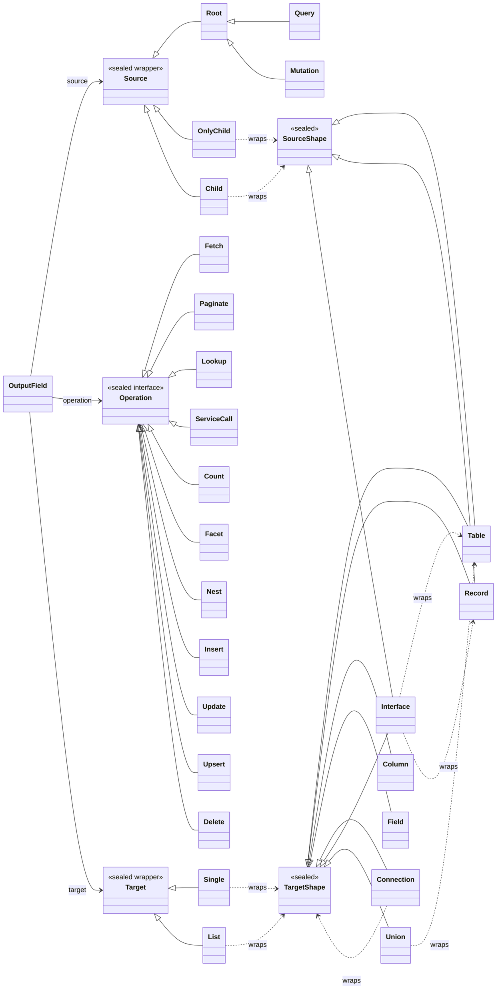

# Pivot the field-dimensional model to (source, operation, target)

The field-dimensional model R290/R299/R305 shipped is `carrier x intent x mapping`. A
walk under the source-object / source-field vocabulary (the original `decompose-sourcekey`
thesis, see Lineage) shows the third axis is mislabeled and the first two are under-named.
The correct model is `(source, operation, target)`: a field is an edge from a **source** it
arrives into to a **target** it projects, spanned by an **operation** it performs. `mapping`
is not a dimension; the catalog-vs-Java distinction it encodes is a per-endpoint *polarity*
that lives on `source` and reappears on `target`.

The full argument and the pros/cons of pivoting are in
[`audits/2026-06-16-source-operation-target-reframe.md`](audits/2026-06-16-source-operation-target-reframe.md).
This item is the decision to pivot and the plan to do it thoroughly. **The defining
constraint is thoroughness:** experience (R287, the staleness audits) shows that leaving
remnants of the retired model is a trap. The old vocabulary must be gone from the rewrite
scope when this item is Done, not merely shadowed by the new one.

## The model at a glance

A field is an edge: it **arrives into** a `source`, **performs** an `operation`, and **projects**
a `target`. `source` and `target` are each a *wrapper around a shape* (the wrapper a multiplicity
layer, the shape the named thing inside); `operation` is a sealed interface of payload-carrying
verbs. This is the whole model the spec iterates; the detail sections below give each axis
concretely.



`Table`, `Record`, and `Interface` sit under both shape seals: that is `SourceShape ⊆
TargetShape` drawn directly (a source is always a row, so it has only the row shapes; the target
adds the scalar shapes `Column` / `Field` and the `Connection` container shape). `Interface`
wraps `Table` or `Record` (a polymorphic result over catalog- or producer-backed participants);
`Interface(Record)` arrives source-side too, because an interface declares its own fields and a
`@service` returning an interface puts that polymorphic record at `env.getSource()` for them.
`Union` wraps `Table` only and is **target-only**: a GraphQL union declares no fields, so a union
value is never a source (nothing resolves against it), and `Union(Record)` is unrepresentable in
the Java type system (it degrades to `Object`, which we cannot interrogate by reflection), so a
record-backed union is unsupported. `Connection` wraps any `TargetShape`.

- **source** (arrival wrapper): `Root` (`Query` / `Mutation`, nothing arrives) | `OnlyChild`
  (one arrives, direct SQL) | `Child` (many arrive, DataLoader); the nested arms wrap a
  `SourceShape`. The wrapper is the emit-strategy dispatch.
- **operation** (sealed interface, `record` arms): `Fetch`, `Paginate`, `Lookup`, `ServiceCall`,
  `Count`, `Facet`, `Nest`, and the writes (`Insert` / `Update` / `Upsert` / `Delete`), each
  carrying its own payload.
- **target** (output wrapper): `Single` | `List`, wrapping a `TargetShape`.

## The model in detail

Both endpoints have the same form: a **wrapper around a shape**, where the wrapper is a
multiplicity layer (the `List` dimension of graphitron's `wrapper()`, GraphQL's own
vocabulary) and the shape is the named thing inside it. They are not equal, the wrapper
arm-sets and the shape value-sets differ per endpoint, but the *form* is shared, and that
shared form is what the "(source, operation, target)" symmetry actually is. See
[the wrapper algebra](#the-wrapper-algebra) for why the two wrappers are one algebra at two
positions, and why keeping cardinality *as a wrapper* (never a free enum) is what stops the
collision this pivot exists to fix.

### source (the arrival endpoint)

The source wrapper is the field's **arrival cardinality** (how many source objects reach its
fetcher); the shape inside it is what arrives. The arm-set is closed and small, three arms
that will never grow, so switching on it is not heavy:

```
source      = Root | OnlyChild(SourceShape) | Child(SourceShape)
Root        = Query | Mutation
SourceShape = Table(<catalog metadata>) | Record(SourceObject, <extraction>)
            | Interface(Table | Record)
```

- `Root` (permits `Query` / `Mutation`): an operation root, no source object arrives (the
  empty product, arrival `Zero`). `Root` carries no `SourceShape`; the `Query` / `Mutation`
  split *is* the operation-legality gate (writes only on `Mutation`, `NodeResolve` only on
  `Query`), so the gate stops being a separate concern.
- `OnlyChild(SourceShape)`: exactly one source object arrives (arrival `One`).
- `Child(SourceShape)`: many source objects arrive (arrival `Many`).

**The wrapper is the emit-strategy dispatch.** `Child` requires a DataLoader to batch the
once-per-parent invocations or it is an N+1; `Root` and `OnlyChild` run their SQL directly,
single invocation, no loader. The `OnlyChild` optimisation *is* "arrive-once dispatches like a
root," so every fetcher emitter switches on `Root` / `OnlyChild` / `Child` by definition once
it exists. That makes arrival arm identity, not a slot: it is the axis the dominant consumer
forks on, and an emitter that fails to consult it is then a non-exhaustive match (a compile
error) rather than the silent N+1 of R308. The three-armed switch is cheap; the closed arm-set
guarantees it stays cheap.

Naming the arms for their referent (the arrival, not a bare `One` / `Many`) is load-bearing,
not cosmetic. A free `Cardinality.MANY` is unreadable because the *target* wrapper carries the
same values (see [the wrapper algebra](#the-wrapper-algebra)); `OnlyChild` / `Child` bind the
count to the source endpoint so it cannot be misread as the field's own output arity. That
collision is live today: `SourceKey.Cardinality` (computed from `wrapper().isList()`, the
target wrapper) and `Carrier.Source`'s cardinality are two indistinguishable `ONE` / `MANY`
enums, and it has cost real confusion.

`SourceShape` is the shape inside the wrapper, the catalog-vs-Java polarity of the parent, and
is a **subset of `TargetShape`** (a source object is always a row, never a scalar):

- `Table`: a catalog table row parent; carries its catalog metadata (table ref / row
  identity), slot detailed in the implementation pass.
- `Record`: a producer-handed domain record parent; carries (a) a `SourceObject` descriptor
  (a new type; today these facts live inside `SourceKey`) holding backing class,
  `env.getSource()` envelope, and produced record type, the facts the field cannot change, and
  (b) the field's own **extraction signature** (how *this* field reads its value off the
  record), reusing the existing `AccessorRef` / `LifterRef` via the (narrowed)
  `SourceKey.Reader` family. This arm is exactly where the decomposed `SourceKey`'s
  Record-source pieces land (see Downstream).
- `Interface(Table | Record)`: a polymorphic source, the value handed to an interface's own
  fields. The catalog case (`Interface(Table)`) is today's table-backed polymorphic parent; the
  producer case (`Interface(Record)`) is a `@service` returning an interface, which we are sure
  to meet, so the model carries it now rather than degrading it to a flat `Record`. A child field
  on the interface dispatches on `__typename` to read against the matched participant.

### operation (the verb)

The operation axis becomes a **sealed interface `Operation` with `record` arms**, replacing
today's flat `enum Intent`. The enum cannot survive the pivot: every arm carries a distinct
payload, and enum constants cannot hold per-arm typed payloads without a kitchen-sink of
optionals (the cross-product disease). Payload-light arms (`Nest`, `Count`) are zero-component
records; a sealed interface accommodates both, an enum cannot. This also aligns the operation
axis with the already-sealed `Carrier` (the source axis), so all three axes are sealed
hierarchies. Each arm carries the slots its kind needs, modeled concretely because that is the
spec's job:

- `Fetch`: a catalog read returning rows (target `Single` / `List` of a row or scalar shape,
  never a connection). Carries the resolved filter surface `List<WhereFilter>`
  (`GeneratedConditionFilter | ConditionFilter`) plus ordering. Field arguments bind the
  **target**: generated conditions key off the return-type table, and user `@condition` (field,
  argument, or input-field position) binds its single `REQUIRED` table slot to the target too.
  `@condition(override: true)` is resolved at classification time into which filters survive;
  override is not an operation fact, the arm carries only the resolved list.
- `Paginate`: a **windowed** catalog read producing a connection, distinct from `Fetch` and the
  sibling of `Count` / `Facet` in the connection-operation family. Target `Single(Connection)`,
  whose `edges` / `nodes` project the page. Carries the same filter surface and ordering as
  `Fetch` (ordering is load-bearing here, cursor stability needs a total order) **plus** the
  pagination window (`first` / `after` / `last` / `before` resolved to a cursor / limit bound)
  and the `pageInfo` / cursor synthesis. This is the home of pagination, which the fused
  `Mapping.TableConnection` had mis-filed on the target axis; `Count` (`totalCount`) and `Facet`
  already sit on the operation axis (modeled-but-unpopulated behind the ConnectionType
  quarantine), and `Paginate` is the windowed-read member they were missing.
- `Lookup`: the positional `@lookupKey` correspondence. Carries `LookupMapping` (key arguments
  to target key columns).
- `ServiceCall`: a developer `@service` invocation. Carries the service `MethodRef` and its
  params; arguments bind to method **parameters**, no table (the code is opaque), the one arm
  whose arguments are not target-bound. This **collapses today's `QueryService` /
  `MutationService`**: they differ only by read-vs-write, which is purely the legality gate now
  carried by `Root`'s `Query` / `Mutation`, and the two classify identically. `ServiceCall`
  carries no read/write bit while services stay root-only (a future nested mutating `@service`
  would put the bit in a slot).
- the writes (`Insert` / `Update` / `Upsert` / `Delete`), each carrying its DML / structural
  payload.

R316 **builds** this hierarchy, populated. The payload is the model, and modeling it is the
point of this spec; "no reader until R314" is a build-sequencing fact, not a reason to leave
the model abstract (the same confusion that nearly cost us the concrete `source` wrapper). What
R314 owns is the emit's *consumption*: re-platforming the generator to dispatch off `operation`
instead of leaf identity. Until then the leaf emit stays the runtime path, so the one real risk
is a second home for facts the leaves still hold. The operation arm is the **model of record**
and the leaves project from it; where that is not yet practical for a given arm, a validator
mirror pins the two in agreement (the discipline `dispatchPerformsReFetch` already applies),
rather than the arm shipping empty.

### target (the projection endpoint)

`Mapping` renamed and restructured to the same `wrapper(shape)` form. The target wrapper is
the field's **own output cardinality**, read straight off `field.getType()`; the shape inside
it is what the field projects:

```
target      = Single(TargetShape) | List(TargetShape)
TargetShape = Table | Record | Column | Field          // base shapes
            | Connection(TargetShape)                   // container shapes: wrap an inner shape
            | Interface(Table | Record) | Union(Table)
```

- `Single` / `List`: the field's output wrapper. This is the value `SourceKey.Cardinality`
  computes today from `wrapper().isList()`; it lives here, on the target, named for GraphQL's
  `List`, not as a free cardinality enum.
- The **base shapes** are `Table` / `Column` (catalog) and `Record` / `Field` (Java), the
  catalog-vs-Java polarity. `SourceShape ⊆ TargetShape`: source has only the row shapes
  (`Table` / `Record`); target adds the scalar shapes (`Column` / `Field`) a source can never be.
- The **container shapes** wrap an inner shape. `Connection(TargetShape)` is a `Single`-wrapped
  shape with its own fields, its many-ness living on those fields (`edges` / `nodes`), classified
  normally rather than on the connection field's wrapper (this retires the fused
  `Mapping.TableConnection`; the "paginated" fact moves to the `operation` `Paginate` arm, not
  `Fetch`). `Interface(Table | Record)` and `Union(Table)` are the polymorphic shapes: the wrapper
  names the participants' backing kind, and the participant set plus per-participant join paths
  ride as payload. `Interface` straddles both seals (an interface has its own fields, so its value
  can be a source); `Union` is target-only (a union declares no fields, so it is never a source)
  and wraps `Table` only (`Union(Record)` degrades to `Object` in the Java type system, which we
  cannot reflect on, so it is unsupported).
- A target shape's **definition can be developer-supplied** instead of catalog-derived, and that
  provenance, not a new operation, is the home for `@tableMethod` / `@externalField`.
  `@tableMethod` supplies the `Table<?>` that `@table` would otherwise resolve (it replaces the
  target table); `@externalField` supplies the `Field<X>` expression a `Column` would otherwise
  read from the catalog (it is just a `Column<T>` whose expression is authored). The `MethodRef`
  rides the target shape as its provenance; the operation stays `Fetch` / projection.
- A `Column` is not always a scalar leaf: a jOOQ embeddable column carries an embedded record, so
  a target `Column` can itself be the **source `Record` for further child fields**. This is the
  shape-level reading of the wrapper algebra below: a field's target shape becomes its children's
  source shape (projected to row granularity), which is *why* `SourceShape ⊆ TargetShape` holds
  and why a source `Record` has origins beyond `@service` / DML payloads.

The endpoints are not equal: the source wrapper has a `Zero` (`Root`) arm the target lacks (a
field always projects something), and `TargetShape` is a superset of `SourceShape`. What they
share is the form. Each owns its polarity, so re-fetch is a record-producing endpoint (a
source `Record`, or a record-producing `operation`) crossing into a catalog `Target.Table`,
read off the two endpoints rather than decoded from a conflated `mapping`.

### the wrapper algebra

The two wrappers are **one algebra at two positions.** The target wrapper is *local*: this
field's own output wrapper. The source wrapper is *accumulated*: the product (fold) of the
ancestor fields' target wrappers, so one `List` ancestor makes every descendant `Many`. A
field's target wrapper thus becomes part of its descendants' source wrapper. The monoid is
trivial and closed over the arms: `Root` is the empty product, `OnlyChild` the `One` identity,
`Child` the `Many` absorber.

```
Root · x        = x          OnlyChild · x   = x
Child · OnlyChild = Child     Child · Child   = Child
```

This is *why* a bare `Cardinality.MANY` is unreadable: the same `{One, Many}` values appear at
both positions (local and accumulated), so detached from its endpoint a cardinality value could
be either, the exact `SourceKey.Cardinality`-versus-arrival collision. The fix that cannot be
lost again is structural: cardinality only ever exists as a wrapper bound to an endpoint, never
as a standalone `SourceCardinality` / `TargetCardinality` type. One named invariant keeps the
two positions honest, `sourceWrapperIsTheFoldOfAncestorTargetWrappers`: `target.wrapper` equals
the field's own output wrapper, and `source.wrapper` equals the fold of the ancestors' target
wrappers. A test asserting the fold makes local-versus-accumulated executable rather than prose.

### the join path

The `@reference(path:)` join route is a slot bridging `source` to `target`, carrying per-hop
conditions that consume **context arguments only** (no field arguments are in scope at a
path-step `@condition`). So the path is not an argument-addressable surface; field arguments
bind `target`, and the path does not perturb the triple.

### the error channel (a cross-cut slot)

The typed-error channel (`errorChannel` on the fetcher-emitting leaves, and the `errors` field's
own `errorTypes` / `transport`) is **not a fourth axis**: it is a cross-cut slot, like the join
path, that only some coordinates carry. It rides alongside the triple (the existing
`WithErrorChannel` marker is its home), never inside `source` / `operation` / `target`. Naming it
a cross-cut keeps the three axes from absorbing a concern orthogonal to arrival, verb, and
projection.

## Leaf reconstruction: the slot translation

The completeness test for the model: given an `OutputField`'s `(source, operation, target)`
coordinate plus its bridge and cross-cut slots, the legacy leaf record (`TableField`,
`RecordTableField`, the `Mutation*` carriers, ...) must be reconstructible. A leaf carrying a
fact the triple cannot hold is a model gap. Walking all leaves of `QueryField` / `MutationField`
/ `ChildField` produces the slot-to-axis assignment below; it is the concrete contract R314
consumes when it re-platforms the emit off leaf identity, and the inverse of R222's type-level
decomposition (R222 says which leaves dissolve; this says where each *slot* lands).

### where each slot lands

| Legacy slot (representative) | Lands on | As |
|---|---|---|
| `returnType: ReturnTypeRef` + `FieldWrapper` | target | the wrapper(shape): `wrapper()` → `Single` / `List`; the arms → `TargetShape` |
| `column` / `columns` / `columnName` (projection side) | target | `Column` shape (arity ≥ 2 is the composite sub-detail) |
| `compaction` / `encode` | target | projection function on `Column` / `Field` |
| `aliasName` | target | projection alias |
| `returnExpression: DmlReturnExpression` | target | `Single` / `List` × `Column`(encoded id) / `Table`(projected) |
| `filters` / `orderBy` | operation | `Fetch` / `Paginate` payload |
| `pagination: PaginationSpec` | operation | the `Fetch` ↔ `Paginate` discriminant; `Paginate` payload |
| `method` / `serviceMethodCall` | operation **or** target provenance | `ServiceCall` payload; `@tableMethod` / `@externalField` ride the target shape |
| `lookupMapping` | operation | `Lookup` payload |
| `tableInputArg` / `inputArg` + `updateRows` / `deleteRows` / `kind` | operation | the write-arm input payload |
| `nestedFields` | operation | `Nest` payload |
| `participants` / `participantJoinPaths` / `discriminatorColumn` | target + bridge | `Interface` / `Union` shape payload + per-participant join paths |
| `SourceKey` (target, columns, path, wrap, cardinality, reader) | splits | `path` / `target` → bridge + target; reader / wrap / backing → `source.Record`; `cardinality` → target wrapper |
| `loaderRegistration` | source | the `Child`-arm batch payload (its presence = `Child`) |
| `parentSourceKey` / `parentResultType` / `accessor` | source | source-object key / shape / `Record` extraction |
| `joinPath` / `fkJoin` / `parentCorrelation` | bridge | the FK route and its step-0 correlation |
| `errorChannel` / `errorTypes` / `transport` | cross-cut | the error channel, not an axis |
| `parentTypeName` / `name` / `location` | field identity | the `OutputField` envelope, not a dimension |

### the collisions the triple collapses

The leaf set reads larger than the model because one concept wears different vocabulary across
leaves. Each is carried once by the unified axes:

1. **Service call**: `method: MethodRef` (child) and `serviceMethodCall: ServiceMethodCall`
   (root) are one call in two records, collapsing onto `Operation.ServiceCall`.
2. **Write input**: `tableInputArg` (INSERT / UPSERT) and `inputArg` + a walker carrier
   (UPDATE / DELETE) are one "rows this write applies" in two shapes, collapsing onto one
   write-arm input payload.
3. **FK route**: `joinPath`, the narrowed `fkJoin`, `participantJoinPaths`, and `SourceKey.path`
   are one join bridge.
4. **NodeId encode**: `compaction: CallSiteCompaction` and the bare `encode: NodeIdEncodeKeys`
   are one target projection.
5. **Return shape**: `returnExpression: DmlReturnExpression` re-expresses `returnType` +
   `FieldWrapper` for DML alone; it dissolves into the target wrapper(shape).
6. **`column`**: the projection on `ColumnField` and the source read-location on `PropertyField`
   are the same name at opposite endpoints, split by endpoint.
7. **Cardinality** (already pinned by [the wrapper algebra](#the-wrapper-algebra)):
   `SourceKey.cardinality`, `LoaderRegistration`, `wrapper().isList()`, and the arrival count are
   one-vs-many at four positions, each a wrapper bound to its endpoint.

### the reconstruction key

```
leaf = f(source shape, source arrival, operation, target shape, target wrapper)
       + { new-query, re-fetch }   // derived slots
```

Worked over the set, this separates the leaf distinctions that are genuine coordinates from those
that are derived slots and therefore collapse:

- `Split*` vs non-`Split` is the `@splitQuery` **new-query** derived slot, not a coordinate.
- `Record*` vs non-`Record` is source `Record` vs `Table`.
- `Lookup*` is operation `Lookup` vs `Fetch`.
- `Bulk*` vs single is target `List` vs `Single`.
- `*Payload` vs `*Table` is target shape `Record` vs `Table` / `Column`.
- `Composite*` is target `Column` arity ≥ 2.

The key being invertible is the model's completeness proof, and it predicts the leaf collapse R314
harvests. A `leafReconstructsFromCoordinate` test over the corpus would make it executable (see
Tests).

## Lineage: from decompose-sourcekey

R316 began as the mechanical `SourceKey` decomposition (evict `target`/`path` to the
field's existing slots, migrate source-object facts to the carrier, leave a source-field
key). That walk is what surfaced the model defect: `SourceKey`'s pieces had no honest homes
because the dimensions themselves were wrong. `SourceKey` is the second, independent witness
to that defect (the audit's first is `requiresReFetch`): its intended meaning is narrow, the
parent/source object's key a DataLoader uses to match a child field's rows back to their
source, yet it had accreted `target` (the read-to table), `path` (the FK route to it), and
`Reader` arms that are really `@service` calls and produced-record re-fetches. Same disease as
`mapping`: a grab-bag forms wherever the model lacks a clean endpoint to file facts under. The
mechanical simplification is now a *downstream consumer* of this pivot (see Downstream), and
R316's identity is the pivot. The original framing is preserved in git history at the
pre-rewrite revision of this file.

The backing audit recommended the inverse container split (a fresh item for the pivot, with
R316 kept as the downstream `SourceKey` consumer). Folding the pivot into R316 is a
deliberate override: it keeps this thread's id and history together. If a reviewer prefers
the audit's split, the move is a re-id, not a redesign.

## Slices

Slice 1 is the model decision; slices 2-4 lift the shipped work onto it; slice 5 is the
thoroughness gate. Land 1 first; 2-4 are sequenced by dependency, not parallel, because they
share the model types.

### Slice 1: Rewrite the R222 model

Revise [`dimensional-model-pivot.md`](dimensional-model-pivot.md) (R222), whose umbrella
explicitly licenses slices to "redraw the diagram as implementation slices land and surface
new understanding." Replace the `carrier x intent x mapping` target model with
`(source, operation, target)`: the `source` and `target` endpoints as `wrapper(shape)` pairs
(arrival wrapper `Root | OnlyChild | Child`, output wrapper `Single | List`, `SourceShape ⊆
TargetShape`), the wrapper algebra (target wrapper local, source wrapper the ancestor fold), the
`operation` payload-carrying arm set (`Fetch` / `Paginate` / `Lookup` / `ServiceCall` /
`Count` / `Facet` / writes, each with its concrete payload, `Paginate` the windowed-read arm the
`TableConnection` decomposition surfaces), and the re-derived re-fetch predicate. Carry over the
[leaf-reconstruction slot translation](#leaf-reconstruction-the-slot-translation) (the collapse
list and the reconstruction key) so R222 records where each legacy slot lands, not only which
leaves dissolve. Documentation only; it pins the vocabulary every later slice speaks.

### Slice 2: The `source` wrapper in code

**Landed (additive cutover).** `Source` (`Root` permits `Query` / `Mutation` `| OnlyChild(SourceShape) |
Child(SourceShape)`) is the new primitive `OutputField.source()`; the producers build it (`QueryField` →
`Root.Query`, `MutationField` → `Root.Mutation`, `ChildField` → `Child(sourceShape())`), and
`requiresReFetch()` plus the validator's re-fetch-mirror message read it. The `Carrier.java` /
`SourceCardinality.java` *type deletion* is deferred to slice 4: cleanly deleting them requires migrating
the `@classified` directive vocabulary and the `classifieddsl/*` harness that slice 4 owns, so per the
additive-cutover technique `carrier()` survives as a `default` deriving `Carrier` from `source()` and the
R281 corpus classifies unchanged. The generator's loader-vs-direct fork stays leaf-based here (R314's emit
re-platforming owns repointing it to the arm); `OnlyChild` is producible but unreached (R305 hard-codes
`Child`), its corpus coverage entry landing with slice 4's source-arm projection test.

Fold `Carrier` into one `source` sealed hierarchy whose arms are the arrival wrapper:
`Root` (permits `Query` / `Mutation`) `| OnlyChild(SourceShape) | Child(SourceShape)`.
`SourceCardinality` is **retired as a standalone type**: its `One` / `Many` become the
`OnlyChild` / `Child` arm identity, and `Zero` is `Root`'s shape-absence. `SourceShape` stays
as the shape wrapped by the nested arms (its internal reshaping, `SourceShape.Record`'s
reflected facts, is the downstream `SourceKey` work, not R316). Rename `OutputField.carrier()`
to `source()`; repoint its producers (`QueryField` / `MutationField` build `Root`; `ChildField`
builds `OnlyChild` / `Child` over `Table` / `Record`, the arm chosen by the arrival fold) and
its readers. The arrival arm is the emit-strategy dispatch (`Child` → DataLoader,
`Root` / `OnlyChild` → direct), so the generator's loader-vs-direct fork reads the arm.
Until R279/R308 compute the true ancestor-product fold, `OnlyChild` is producible but
conservatively unreached (R305 hard-codes `Many`); it carries one documented
`NOT_CORPUS_COVERED` entry, correct-but-empty, not unrepresentable. Retire `Carrier.java` and
`SourceCardinality.java` as standalone types.

### Slice 3: `operation` and `target` in code

**Landed (additive cutover), in two steps.** `Operation` (slice 3a) and `Target` (slice 3b) are the
new primitives `OutputField.operation()` / `OutputField.target()`, built populated by the leaf
producers; `intent()` / `mapping()` survive as derived `default` bridges (`intent()` recovers the
`QueryService` / `MutationService` split from `source()`, not leaf identity; `mapping()` derives over
`target().shape()`, deriving `TableConnection` from `Single(Connection(...))`). The R281 corpus
classifies unchanged. Per a `principles-architect` self-check on the design fork: `ServiceCall`
collapses `QueryService` / `MutationService` and holds its two un-unified call carriers
(`ServiceMethodCall` root / `MethodRef` child) in a transitional `Call` holder pinned to R314, not a
semantic axis; the write arms carry their narrowest input directly (no `WriteInput` union); the read
family decomposes by return wrapper into `Fetch` / `Paginate`, the connection *shape* living on
`target` as `Single(Connection)`; `TargetShape` is lean (`Interface` / `Union` participant payloads
and the `Interface(Table | Record)` backing distinction modeled-but-unpopulated, mirroring the flat
`SourceShape`); all declared-gap operation arms are modeled (`Count` / `Facet` / `EntityResolve` /
`UpdateMatching` / `DeleteMatching`), not only the ones a leaf reaches. The `Intent.java` /
`Mapping.java` *type deletion* and the `intent()` / `mapping()` bridge removal are deferred to slice 4
(corpus migration), pinned below.

Convert the `enum Intent` to a **sealed interface `Operation` with `record` arms** and build
them **populated** (`Fetch`'s
`List<WhereFilter>` + ordering, `Paginate`'s window + `pageInfo` synthesis, `Lookup`'s
`LookupMapping`, `ServiceCall`'s `MethodRef` + params, the writes' DML payload), `ServiceCall`
collapsing today's `QueryService` / `MutationService`, `Paginate` joining the existing `Count` /
`Facet` connection-operation arms. The operation arm is the model of record; the still-leaf
emit projects from it (or a validator mirror pins agreement where it cannot yet), so the arms
are concrete here, not deferred. R314 re-platforms the emit to dispatch off `operation` rather
than leaf identity (see Relationships). Restructure `Mapping` into the `target` wrapper:
a `Single(TargetShape) | List(TargetShape)` sealed hierarchy, the wrapper read off
`field.getType()` (the value `SourceKey.Cardinality` computes today from `wrapper().isList()`),
the shape carrying the catalog-vs-Java polarity. The fused `Mapping.TableConnection` value
**decomposes**: `Connection` becomes a `Single`-wrapped `TargetShape`, and its "paginated" fact
becomes the `operation` `Paginate` arm (joining `Count` / `Facet`), not a `Fetch` slot. Rename
`OutputField.intent()` to `operation()` and `mapping()` to
`target()`. Repoint all readers: `FieldBuilder`, `GraphitronSchemaValidator`,
`ServiceMethodCallEmitter`, `TypeFetcherGenerator`, the catalog classification
(`TypeClassification`, `FieldClassification`, `CatalogBuilder`).
**Carve-out:** `LookupMapping` and `MappingEntry` are the `@lookupKey` correspondence (the
eventual payload of `Operation.Lookup`), not the `Mapping` dimension. The `Mapping` to `Target`
rename must not sweep them. The retirement inventory lists them explicitly as do-not-touch.

### Slice 4: Lift R281 (focus) and the derived layer

**Landed, in two steps.** Slice 4a re-derived `OutputField.requiresReFetch()` and the validator's
`dispatchPerformsReFetch` mirror over `target().shape()` / `operation()` / `source()` (the strict bare
`TargetShape.Table` guard, behaviour-preserving against the old `mapping() != Mapping.Table` gate), removing
the only production/internal readers of the bridges. Slice 4b migrated the `@classified` corpus harness onto
the new axes and deleted the bridges and the four retired types (`Carrier` / `Intent` / `Mapping` /
`SourceCardinality`). Decisions taken in 4b (a `principles-architect` self-check on the comparison-altitude
fork informed these):

- The `@classified` directive's `carrier:` / `intent:` / `mapping:` / `sourceCardinality:` became the
  `wrapper(shape)` pairs: `source:` (flat `SourceWrapper` {Query, Mutation, OnlyChild, Child} + the existing
  `sourceShape:`), `operation:` (the 15 `Operation` arms), and `target:` (`TargetWrapper` {Single, List}) +
  `targetShape:` (the 7 `TargetShape` arms). The connection coordinate pins the decomposition as
  `target(Single, Connection)`.
- `DimensionTuple` compares each axis at the altitude the directive can express, not the payload: `Source`
  by full structural equality (payload-free, fully reconstructible), `Operation` by arm **type token**, and
  `Target` by a `(wrapper, outer-shape)` type-token pair (the `Connection` inner shape is not asserted at the
  connection coordinate). The tokens are resolved from the seals via `sealedLeaves`-backed name maps, so the
  SDL-vs-Java mirror pins the name set; per the architect, the coordinates are type tokens rather than raw
  strings. The corpus thus asserts **coverage equivalence** (which arm the classifier lands on), exactly the
  guarantee the old flat-enum corpus gave; the arm payloads the directive cannot reconstruct are exercised
  behaviourally by the pipeline / execution tiers.
- The recommended `leafReconstructsFromCoordinate` test is **deferred** (not landed this slice): the old
  corpus never pinned payloads either (`Intent` / `Mapping` were flat, so `.equals()` was identity), so no
  guarantee regressed, and the arm payloads are already exercised by the execution tier. It remains a
  worthwhile follow-on completeness pin.

Migrate `DimensionTuple`
(`(Carrier, Intent, Mapping)` to `(Source, Operation, Target)`) and the `@classified` directive.
Each endpoint is a `wrapper(shape)` pair: `source:` is the arrival wrapper
`{Root(Query | Mutation) | OnlyChild | Child}` plus a `sourceShape:` for the nested arms;
`target:` is the output wrapper `{Single | List}` plus a `targetShape:`; `operation:` replaces
`intent:`. The former `carrier:` / `sourceShape:` / `sourceCardinality:` and `mapping:` all
reconstitute from these. A corpus coordinate for a connection field pins the decomposition,
`target(Single, Connection)` with the connection type's `edges` field at `target(List, ...)`,
so the "Connection is a `Single`-wrapped shape" invariant is a live assertion, not prose.
Migrate the `classifieddsl/*` harness (`ClassifiedCorpus`,
`ClassifiedDsl`, `ClassifiedHarness`, `QueryViewRenderer`) plus its tests
(`ClassifiedDslTest`, `QueryViewRendererTest`, `GraphitronSchemaBuilderTest`,
`SingleRecordPayloadPipelineTest`, `SourceShapeProjectionTest`, `TypeRegistryTest`,
`ConstructorFieldValidationTest`). Re-derive `OutputField.requiresReFetch()` over
`(source-polarity / operation, target-shape)` (a `Record` source or record-producing
`operation` crossing into a `Target.Table`), replacing the `mapping() != Mapping.Table` gate;
the existing `ReFetchDerivationTest` is migrated, not added.

**Retire the slice-2 and slice-3 bridges.** Slices 2-3 landed `Source` / `Operation` / `Target`
additively, leaving `OutputField.carrier()` / `intent()` / `mapping()` as `default` bridges deriving the
retired `Carrier` / `Intent` / `Mapping` from the new primitives so the corpus classified unchanged; the
corpus is their last reader. Once this slice repoints the corpus onto `source()` / `operation()` /
`target()`, delete those three bridge methods and `Carrier.java`, `SourceCardinality.java`,
`Intent.java`, and `Mapping.java` (the retired enums: `SourceCardinality`'s `One` / `Many` already live as
the `OnlyChild` / `Child` arms; `Mapping.TableConnection` already decomposed into `Single(Connection)` +
`Operation.Paginate`). The slice-3 `ServiceCall.Call` holder and the `Interface` / `Union` /
`Connection` payloads stay modeled-but-unpopulated until their corpus coordinates land here. Slice 5's
remnant grep is the backstop that none survive.

The `dispatchPerformsReFetch` validator mirror is re-expressed over the new axes but **survives
R316 by design**: it guards the still-leaf-dispatched generator against `requiresReFetch()`
drift. Retiring it requires the emit to read `requiresReFetch()` directly, which is R314's
emit re-platforming, out of scope here. `SourceShapeProjectionTest` becomes a `source`-arm
projection test.

### Slice 5: Thoroughness gate

The no-remnants mandate, made enforceable rather than aspirational:

- **Code.** No `Carrier` / `Intent` / `Mapping` / `SourceCardinality` type remains in
  `graphitron/src` (excluding the `LookupMapping` / `MappingEntry` carve-out), and no
  `TableConnection` value (it decomposed into `Single(Connection)` + `Fetch`). `SourceShape`
  survives (as the shape wrapped by the source arms); `SourceCardinality` does *not* (it became
  `OnlyChild` / `Child` arm identity), so the remnant grep targets `Carrier` / `Intent` /
  `Mapping` / `SourceCardinality` / `TableConnection`. Two distinct guards, not one: the
  *coverage* gate is the disjoint-exhaustive partition over the `source` and `Operation` seals
  (the shape `GeneratorCoverageTest.everyGraphitronFieldLeafHasAKnownDispatchStatus` already
  uses for leaf dispatch), proving every arm is handled; the *remnant* guard is a supplementary
  repository-grep for the retired type names, proving stale names and prose are gone, not merely
  shadowed. The grep is not a coverage check and must not be relied on as one.
- **Wrapper invariant.** A named test, `sourceWrapperIsTheFoldOfAncestorTargetWrappers`, pins
  the two-position algebra: `target.wrapper` equals the field's own output wrapper, and
  `source.wrapper` equals the fold of the ancestors' target wrappers (`Root` empty product,
  `OnlyChild` the `One` identity, `Child` the `Many` absorber). This is the structural guard
  that keeps cardinality from ever drifting back into a free `ONE` / `MANY` enum.
- **Docs.** Sweep the four `.adoc` files that name the old axes
  (`code-generation-triggers.adoc`, `argument-resolution.adoc`, `typed-rejection.adoc`,
  `rewrite-design-principles.adoc`) to the new vocabulary. (`getting-started.adoc` does not name
  the axes, its only "intent" is colloquial, so it is out of scope.) The user-facing-doc check
  applies.
- **Test-comment prose.** Slice 4 migrated the load-bearing `@classified` directives but left the
  explanatory prose comments that describe each verdict in the old `(carrier, intent, mapping)`
  vocabulary: the per-example block comments in `ClassifiedCorpus` (e.g. "Source / Fetch / Table",
  "carrier Mutation, mapping Record", a stray `Mapping.Record`) and the corpus cross-reference comments
  in `GraphitronSchemaBuilderTest` (which quote `@classified(carrier: …)` verbatim). The remnant grep is
  the backstop that these capitalized type names are gone; sweep the prose to the new vocabulary as part
  of this gate.
- **Changelog.** The R290/R299/R305 changelog entries describe a model that no longer
  exists; add a forward note so a reader is not misled, without rewriting history.

## Tests

- The `@classified` corpus is the behavioural backstop: migrated to the new axes, it must
  stay equivalent in *coverage* (every coordinate that classified before classifies after,
  to the renamed-but-corresponding verdict). `everyDimensionValueIsExercised` and the
  coverage/disjointness meta-tests carry over per axis (now over the `source` wrapper arms
  `Root` / `OnlyChild` / `Child`, the `target` wrapper arms `Single` / `List`, and the two
  shape sub-seals).
- `sourceWrapperIsTheFoldOfAncestorTargetWrappers` (new): asserts `target.wrapper` is the
  field's own output wrapper and `source.wrapper` is the fold of the ancestors' target
  wrappers, making the two-position algebra executable rather than prose.
- Slice 4 migrates the existing `ReFetchDerivationTest` onto the new axes (behavioural, no
  `code().toString()` body matches) and keeps its validator-mirror agreement check.
- `leafReconstructsFromCoordinate` (new, recommended): over the R281 corpus, assert the legacy
  leaf rebuilt from `(source, operation, target)` plus the bridge / cross-cut slots equals the
  classified leaf, making the reconstruction key executable rather than prose. This is the
  completeness backstop that a future slot fails to find a home.
- The `source` seal gets a sealed-leaf exhaustiveness guard (what `SourceShapeProjectionTest`
  becomes); the arms are exercised by corpus coordinates with a documented `NOT_CORPUS_COVERED`
  for any arm no example reaches.
- Full reactor green (`mvn -f graphitron-rewrite/pom.xml install -Plocal-db`), including the
  execution tier, since the rename touches classification that the whole pipeline reads.

## Downstream: the `SourceKey` decomposition

The original `decompose-sourcekey` work becomes the first concrete consumer of the new model,
specced as its own follow-on once this pivot lands: `SourceKey.target` / `path` to the
`target` dimension, the source-object facts and the field's extraction signature to
`source`'s `SourceShape.Record` arm, the service call and its reflected result to
`Operation.ServiceCall`, leaving a `Record`-source-only field key. It is no longer in R316's
scope; the pivot is the prerequisite that gives those pieces honest homes.

## Relationships

- **R222** (dimensional-model-pivot): the umbrella this revises. Slice 1 rewrites its model
  section; R222 explicitly permits slices to redraw it.
- **R290 / R299 / R305**: the shipped `carrier x intent x mapping` materialisation, corpus
  migration, and `Carrier.Source` build. Slices 2-4 lift their output onto the new model;
  this item is where their vocabulary is retired.
- **R302** (rename-childfield-to-sourcefield): wanted to rename `ChildField` to `SourceField`
  to align the field name with `Carrier.Source`. R316 retires `Carrier.Source` and re-aligns
  `ChildField` with the nested source wrapper arms (`OnlyChild` / `Child`) instead, so this
  pivot likely moots or reverses R302.
- **R314** (dissolve-reentry-leaves-dimensional-emit): owns the emit **re-platforming**, not the
  model. R316 builds `Operation` populated (the payloads are the model); R314 switches the
  generator to dispatch off `operation` / `source` / `target` instead of leaf identity, dissolves
  the re-fetch leaves, and retires the `dispatchPerformsReFetch` mirror R316 leaves standing. The
  division is model (R316) versus its consumption (R314), not payload-by-payload deferral.
