# The Graphitron data model

## In one paragraph

Every GraphQL field has a **coordinate**, its `(parentType, fieldName)`, and Graphitron's job is to
turn each coordinate into the Java that resolves it. Today it does so by mapping each coordinate to one
large "leaf" object that welds together everything the field needs at once, and those leaves multiply
into a cross-product (`Split` x `Lookup` x `Composite` x ...) that this spec exists to dissolve. The
dissolution has two halves.

- **Front half, the facts.** Instead of one fat leaf per field, store a handful of small, independent
  *facts* about the coordinate, each found by its own walk: where the source object arrives from
  (`source`), what the field returns (`target`), which operations it triggers (`operation`: select,
  join, paginate, condition, ...), whether its value crosses a table (`reference`), and how to read the
  value back out (the read-side facts). Adding a capability adds a fact, not a new leaf type.
- **Back half, the method graph.** Instead of one tangled method per field, emit a *graph of small Java
  methods* that call each other by name, where each method sits at its own natural granularity (one per
  field, one per type, one per query launcher, ...). The points where one method calls another are
  **seams**. The graph must be closed: every name a method calls is a method we also emit.

The two halves meet at the `operation` relation: a coordinate's facts decide which seams its query
composes. A worked example is `film.language`: one coordinate, whose facts are a `source` (a `Film` row
arrives), a `target` (it returns one `Language`), and a `reference` (the value lives on another table,
reached by a foreign key); together those trigger a `join` and a `select`. No leaf type encodes "single
table field reached by a reference"; the facts do, and they add rather than multiply.

This item is the **model**: the facts, the method graph, and the integrity check that ties them
together. Re-platforming the generator's emit onto the model is a separate item, **R314**. Suggested
reading order is this orientation, then *The model* (the ER diagram and the fact catalog) and *What the
model enables*, then the detail: the front half (*The normalized schema: the coordinate and its facts*)
and the back half (*Operations are realized by seams*). The lettered **Discovery** threads (A-K) at the
end record how the model was derived by walking the current emitters; they are the evidence, referenced
throughout, not prerequisites to read first.

## The model

The entity is the schema **coordinate**, the GraphQL spec's `SchemaCoordinate` stored decomposed into its
grammar columns (the key system is *The natural keys* below; `Foo.bar` is the output-field case). The model
is that coordinate together with a small set of **facts**, each an independent functional dependency found
by its own walk. The leaf
zoo, the per-field "graphitron field", and the two library types (`DataFetcher`, `QueryPart`) are
denormalized views over these facts; a capability is added by adding a fact, not a new leaf type. The whole
model at a glance:

```mermaid
erDiagram
    COORDINATE ||--|| SOURCE : "arrives via"
    COORDINATE ||--|| TARGET : "returns"
    COORDINATE ||--o{ OPERATION : "triggers (a set)"
    COORDINATE ||--o| REFERENCE : "crosses a table"
    COORDINATE ||--o| RESOLVED_TABLE : "resolves against"
    COORDINATE ||--|| ACCESSOR : "value read by"
    COORDINATE ||--o| DISCRIMINATION : "recovers concrete type"
    COORDINATE }o--|| SOURCE_OBJECT : "cast target (type-level)"
    COORDINATE ||--o{ CAPABILITY_TAG : "@capability (reserved)"
    COORDINATE ||--o| SOURCE_LOCATION : "locate (joined at request time, not stored)"

    REFERENCE ||--|| REFERENCED_TABLE : "destination"
    REFERENCE ||--|{ JOIN_STEP : "linearized join graph"
    JOIN_STEP ||--|| TABLE_EXPR : "target node"

    OPERATION ||--o| ERROR_GUARD : "if it can throw"

    ACCESSOR ||--o| NODE : "@nodeId codec"
    ACCESSOR ||--o| ENUM : "enum coercion"

    CAPABILITY_TAG }o--|| SLUG : "names (slug namespace)"

    COORDINATE {
        enum kind "one of five SchemaCoordinate variants (sealed)"
        key coordinate PK "per-variant Name columns, all non-null; see The natural keys"
        string canonical "derived render of the key: Foo / Foo.bar / Foo.bar(baz:) / @foo(bar:)"
    }
    SOURCE {
        enum kind "Root | OnlyChild | Child (sealed)"
        shape shape "carried by OnlyChild / Child only: Table | Record (Root carries none)"
    }
    TARGET {
        enum wrapper "Single | List"
        enum shape "Column | Table | Record | Field"
    }
    OPERATION {
        enum kind "select join paginate condition orderBy serviceCall DML (sealed; payload varies by kind)"
        anchor address "which query unit it lands in"
    }
    REFERENCE {
        path path "authored @reference or inferred FK (coalesced view)"
    }
    RESOLVED_TABLE {
        table table "derived view: referencedTable then source then target"
    }
    JOIN_STEP {
        int stepIndex
        on on "sealed On: ColumnPairs | Predicate | Lateral (on Hop; LiftedHop carries lifted slots; shipped by R438/R435)"
    }
    TABLE_EXPR {
        enum arm "Catalog | MethodCall | RoutineCall (sealed; MethodCall/RoutineCall carry a callable + arg bindings)"
    }
    SOURCE_OBJECT {
        class castTarget "never a table"
        bool tableBound
    }
    ACCESSOR {
        locator locator "sealed read mechanism: typed jOOQ field | by-name field | record/getter | passthrough | localContext"
    }
    NODE {
        string type
        table table
    }
    ENUM {
        string name
        type backing "Java enum | String | numeric (derived)"
    }
    DISCRIMINATION {
        enum domain "row | exception (sealed; signal family depends on domain)"
        enum signal "row {RecordClass | DiscriminatorColumn} or exception {ExceptionClass | SqlState | VendorCode | Validation}"
    }
    ERROR_GUARD {
        enum channel "Outcome | PayloadClass | LocalContext"
        ref handlerSet "interned partition"
    }
    CAPABILITY_TAG {
        slug slug "@capability / @exemplifies edge; reserved, not yet shipped"
    }
    SLUG {
        string name PK "capability catalog: third referenced namespace"
        string definition
    }
    SOURCE_LOCATION {
        string uri "value of locate; partial (absent for built-ins)"
        int line
        int column
    }
```



The diagram is itself a denormalized view, the same move as *the leaf zoo is a denormalized view* below. A
discriminator marked **(sealed)** is a tagged union, not one relation with nullable-by-arm columns: each
variant carries only its own non-null columns (concrete-table inheritance, exactly like the coordinate key in
*The natural keys*), and the per-variant columns are normalized in that fact's deep-dive below. Flattening a
union into one box with a `kind` / `arm` / `domain` enum is the diagram's convenience, not the model's shape;
in the type system each is a `sealed` interface (`Source`, `Operation`, `JoinStep`, `TargetShape`,
`ErrorChannel`, the discrimination signal). The unmarked entities are genuine single relations.

The catalog, each row a fact with its own deep-dive below:

| Fact | Cardinality | Sourced from | Role |
|---|---|---|---|
| `source` | 1:1, total | parent + the edge into the field | where the source object arrives and how many; the parent shape |
| `target` | 1:1, total | `field.getType()` | the field's own output wrapper (`Single` / `List`) and shape |
| `operation` | 0..N (a set) | `@service` / `@condition` / `@orderBy` / `@mutation` / `@asConnection` / a table-bound return | the QueryPart-emitting commands the query unit composes |
| `reference` | 0..1 | `@reference`, else inferred unique FK | the value lives off the parent's table; lowers to a `join` |
| `referencedTable` | 0..1 (iff `reference`) | `@reference` | the reference's destination table, named in its own right |
| `resolvedTable` | 0..1, derived | coalesce `referencedTable ?? source.table ?? target.table` | the catalog table the `@field` resolves against |
| `tableExpr` | per table node | `@tableMethod` / `@routine` | materializes a table *node* (`Catalog` \| `MethodCall` \| `RoutineCall`) |
| `joinPath` | the `reference`'s resolved form | `@reference` | the linearized join graph: a start node plus ordered `JoinStep`s |
| `source object` | type-level | the parent type's record shape (`@sourceRow` for a DTO) | the cast-target record the read casts to; never a table |
| `accessor` | 1:1 (read side) | `@field` / `@externalField` | the field-level **locator** that reads the value back out |
| `node` | accessor refinement, 0..1 | `@node` / `@nodeId` | the nodeId codec and its key projections |
| `enum` | accessor refinement, 0..1 | `@field` on `ENUM_VALUE` | the authored value set and a derived backing type |
| `discrimination` | 0..1 | `@discriminate` / `@discriminator` / `@error` | concrete-type recovery, over the **row** or **exception** signal domain |
| `errorGuard` | operation sub-fact | `@error` | on a throwing operation: a transport channel and an interned handler partition |
| `capabilityTag` | 0..N (reserved) | `@capability` / `@exemplifies` | tags the coordinate with a stable slug from the capability catalog; knowledge-surface only, not yet shipped |
| `sourceLocation` | 0..1, joined not stored | joined against `SourceWalker.Index` at request time | the `locate` value; a fact *about* the coordinate, keyed by the coordinate, never itself a key |

**The model is closed.** Every active directive's effect has an owning fact in this catalog; the
completeness audit, directive by directive, is *Directive coverage* near the end. The two halves of the
lowering, these facts (front) and the method graph that consumes them (back), meet at the `operation`
relation, detailed throughout the rest of this document.

## The natural keys

The model's spine is its natural keys, and the entity key is not ad-hoc: it is the GraphQL specification's
**`SchemaCoordinate`**, the same coordinate this document is named for. The spec already standardizes the
grammar for addressing every element of a schema, so the model adopts it rather than inventing a key.
(Later sections still sketch the coordinate as `(parentType, fieldName)` for readability; that is shorthand
for the `MemberCoordinate` output-field case. The ER diagram in *The model* draws the full key.)

**The coordinate is a `SchemaCoordinate`, stored decomposed into its grammar columns.** The spec's five
productions are five coordinate kinds, each carrying exactly the `Name` positions of its production, and the
coordinate *kind* is just which production matched:

| Kind | Columns | Canonical string |
|---|---|---|
| `TypeCoordinate` | `typeName` | `Foo` |
| `MemberCoordinate` | `typeName`, `memberName` | `Foo.bar` |
| `ArgumentCoordinate` | `typeName`, `memberName`, `argumentName` | `Foo.bar(baz:)` |
| `DirectiveCoordinate` | `directiveName` | `@foo` |
| `DirectiveArgumentCoordinate` | `directiveName`, `argumentName` | `@foo(bar:)` |

The columns are what the model keys, joins, and indexes on: every member of a type is a prefix scan on
`typeName`, every argument of a field a prefix scan on `(typeName, memberName)`. The canonical string is a
**derived render** over the columns, never the stored key. Spec fidelity earns three things from one render
function: the string is the spec's own serialization, it is the stable id the model-context surface hands an
agent to traverse between answers, and it is the per-coordinate key the language server files its
classification under. One coordinate system, one render, three readers, no second id grammar to maintain.

**This is a sealed union, not one table with nullable columns.** Reading the five kinds as columns of a
single `coordinate` relation would make `typeName` / `memberName` / `argumentName` / `directiveName` nullable
and push "which columns are populated" onto an unenforced convention keyed off `kind`: single-table
inheritance, the denormalized shape this whole document argues against. The model is instead a sealed
`SchemaCoordinate` with five variants, each a relation carrying exactly its own `Name` positions, all
non-null. That is concrete-table inheritance, the relational name for the sealed hierarchies the project
already builds in the type system, so the key obeys the same compile-time discipline as the facts that hang
off it. The shared leading columns are real, `typeName` heads Type / Member / Argument and `directiveName`
heads Directive / DirectiveArgument, and that shared prefix is exactly what the prefix scans key on; it is
shared structure across variants, not one flat row with holes. The ER diagram in *The model* draws the
coordinate as a single keyed box because its subject is the facts that hang off the coordinate, not the key
taxonomy; the decomposition lives here.

`MemberCoordinate` is a single key covering what earlier drafts split into three: an output field
(`Film.language`), an input-object field (`FilmWhereInput.title`), and an **enum value** (`Color.RED`, the
`EnumValue` key the enum facts carry). All three are `Name.Name`; they were never distinct key spaces. The
directive productions make directives **first-class addressable elements**, not merely things that annotate
other coordinates: a directive definition is `@foo`, its argument `@foo(bar:)`.

**Input fields are member coordinates of their own input type, not a path under the consuming field.** The
spec is definition-keyed and has no dotted-path coordinate, so a nested input field is addressed as a
`MemberCoordinate` of its input type (`FilmWhereInput.actor`, then `ActorWhereInput.lastName`), and the
use-site "path" earlier drafts wrote as `(typeName, fieldName, inputPath)` is not a coordinate at all: it is
a **derived traversal** through the coordinate graph, an `ArgumentCoordinate` followed by a chain of
input-type member coordinates. This is where the authored / derived split lands precisely. The authored
facts (`@field`, `@reference`, `@nodeId` on an input field) live at the definition member coordinate, which
is where the editor edits them: the cursor sits inside the input type's definition, consumed by many fields,
so the definition coordinate is the only key available. The use-site resolution (which table the input binds
against, the inferred FK, the generated condition's column) depends on the consuming field, so it is a
**derived join** over `(input member coordinate, consuming coordinate)`. Definition-keyed authored fact,
use-keyed derived binding: the provenance axis, stated in the spec's own grammar.

**Everything beyond the spec's coordinate set is a relation over coordinates, never a new coordinate kind or
an extra column.** A directive *application* (a `@reference` written at `Film.language`) is an **edge**
joining the host coordinate to the directive coordinate and carrying the applied argument values; the
*Directive coverage* audit is exactly that edge set, and "this `@reference` lowers to a `join` fact" is one
edge resolving to facts. The use-site binding above is a derived relation. Neither becomes a sixth coordinate
kind. The coordinate stays a faithful, column-decomposed `SchemaCoordinate`; the model's extensions sit
outside the key.

### The two referenced namespaces

A coordinate's facts point into two external namespaces, and they are one shape seen from two angles: **the
jOOQ catalog** (tables, columns, foreign keys, primary and unique keys, indexes) keyed by jOOQ identity, and
**the Java surface** (classes, methods, parameters, record components) keyed by Java identity. Both are
generated from source we write, the catalog by jOOQ codegen from the DDL, the Java surface by `javac` from
the consumer's classes, so both are **complete and authoritative within a snapshot and both lag their source
identically**: an un-regenerated migration leaves the catalog stale exactly as an un-recompiled class leaves
the Java surface stale. There is no completeness or authority difference between them; that lifecycle is
common, the snapshot / freshness property applying uniformly to both.

Both back the same family of reads, distinguished only by which consumer reads them:

| Read | Access pattern | Reader |
|---|---|---|
| resolve | unique-key lookup | code generation |
| validate | membership | diagnostics |
| complete | prefix-key scan | completion |
| describe | the description attribute | hover, the knowledge surface |
| locate | join to the position relation | go-to-definition |
| invert | reverse index | impact analysis, find-references |

Code generation does only `resolve`; the model described the catalog as if that were the only read because
code generation was the only consumer in view. The other five are what absorbing the language server and the
knowledge surface adds, and they are one shape over both namespaces.

The two differ in exactly one way, and it is structural, not about authority. **The catalog is a relation
graph the model traverses**: tables are linked by foreign keys, the `reference` fact's `joinPath` walks them,
node-key projection follows the foreign-key column pairings hop by hop. **The Java surface is a flat
namespace the model binds into**: a class contains methods and a method contains parameters, but there are no
edges between methods for a fact to traverse; a fact lands on a node and stops. The catalog's heaviest
machinery has no Java analog because the Java surface has nothing to traverse.

A Java method's natural key is its **signature**, the name plus the ordered parameter types, because a method
name alone is not unique in a class (overloads) the way a column name is unique on its table. Arity (a count
of parameters) is a lossy projection of that signature and is not the key; a position join that comes back
"ambiguous" is an artifact of keying on the projection rather than the signature, and it disappears once the
signature is the key. Parameter names are not part of the identity (they cannot disambiguate overloads); they
ride along as payload the model already carries for argument mapping and hover.

## What the model enables: three consumers

One base, three consumers, and the consumers do not all read it at the same depth. The facts are the base
relations; everything a consumer reads is a **view** computed over them. The model already ships this
layering, so R333's job here is to name it and to keep it from fracturing into separate models as the leaf
zoo dissolves.

**The layering, as it ships today.** Between the facts and the consumers sit two layers of view:

- **The classifier (the denormalized leaves).** `GraphitronField` and its permits (`ChildField`,
  `QueryField`, `MutationField`, `InputField`) and `GraphitronType`. This is the leaf zoo, and it is a
  denormalized view over the facts (the argument of *Normalization: the leaf zoo is a denormalized view*).
  **Code generation reads it directly**: the `DataFetcher` joins `source` and `target` and dispatches the
  operation set, each operation rendering through a named seam, and thread I's referential-integrity closure
  is the build's correctness test.
- **The projections.** `FieldClassification`, `TypeClassification`, `TypeBackingShape`, `CompletionData`,
  `CatalogFacts`: a second view, built from the classifier by an exhaustive, compile-checked switch
  (`CatalogBuilder.projectFieldClassification` and its siblings) and sized to the questions the editor and
  the agent ask (hover payloads, completion candidates, catalog descriptions). **The language server and the
  model-context server read these**, the former to validate / complete / describe / locate as the author
  types, the latter to describe / locate / invert for an agent navigating the schema (the six reads of *The
  two referenced namespaces*).

So "one model, three readers" is not aspirational, it is implemented, with a compile-enforced seam tying the
projections to the classifier. What it is *not* is three co-equal readers of one flat fact set: there is a
base, there are views, the views stack two deep, and the consumers enter at different depths.

**Code generation is the narrowest view, not the model.** It reads the *resolved* values (the `resolvedTable`
coalesce, the inferred FK, the rolled-up enum backing) and demands a total, integrity-clean snapshot before
it runs. It does not select the columns the other two live on: the authored form behind each resolved value,
the description text, the source position. Those columns are in the base regardless; code generation simply
does not project them. Calling code generation "the model" was the original error; it is the projection that
selects the fewest columns and imposes the strictest precondition, no more privileged than the others.
Re-platforming the emit onto the facts is R314.

**The invariant that keeps it one model: the projection seam re-sources from the facts.** Today
`CatalogBuilder.projectFieldClassification` switches over the classifier's leaf permits to build
`FieldClassification`. When the leaf zoo dissolves into facts, that switch must re-source, from the leaf
permits to the facts, and its compile-time coverage guarantee must move with it. This is the single
load-bearing requirement of widening the model to three consumers. Miss it and the dissolution proceeds on
the code-generation side while the projections still need the old leaf permits, so the leaves are kept alive
as a shim purely to feed the editor and the agent, and the leaf zoo we set out to dissolve returns as a
second model whose only job is the projection layer. Facts, revived leaves, and projections is three models.
The fix is to point the projection seam at the facts and let its coverage switch fail to compile until every
projection re-sources, the same falsifiable-closure discipline thread I applies to the emit.

The shared discipline is *We are data modeling*: the facts are typed, keyed relations in the type system,
materialized as in-memory collections guarded by a referential-integrity check, not sat on a query-engine
runtime. The three consumers read views over one base; the base carries every column some view needs, and no
consumer owns a private model.

## Provenance, description, and capability

The section above promised the base carries columns code generation does not select. Three are due here, and
they are a test of a relational instinct: **do not assume a fact's origin is a column on the fact.** Authored
data and inferred data often come from different walks, the directive walk versus the catalog or producer
walk, and when they do the natural form is **separate relations** coalesced by a view, not one relation with
a provenance tag. Pick per fact: a column when there is one value in one slot, separate relations when the
origins are independent walks or the values are multi-valued. The three facts below pick three different
shapes, which is the point.

### Provenance

A fact's provenance is `Authored` (a directive at a source location), `Inferred` (derived from the catalog or
the producer types), or `Defaulted` (a rule). The model already carries this, and the lesson is that the
shape varies with the source:

- **Separate relations, coalesced** when authored and inferred come from different walks. `resolvedTable` is
  a view, the coalesce `referencedTable ?? source.table ?? target.table` over three independently-walked
  facts. `reference` is "authored `@reference` *or* inferred unique FK", two populations of one 0..1 slot.
  `condition` is the cleanest case: `authored_condition` and `generated_condition` are genuinely separate
  relations, both multi-valued, both live, conjoined by union-then-suppress, and no provenance column could
  hold them because a coordinate carries both at once.
- **A column** when there is one value in one slot. `@node(typeId:)` is a single value the author either
  wrote or let default to the type name; a provenance attribute on the one relation (equivalently, a sparse
  authored relation plus a default rule) suffices. The shipped `NodeMetadata` is exactly this: it stores the
  authored `typeId` / `keyColumns` and leaves the deduced cases null, so the authored population is one sparse
  relation and the resolved value is the view that falls back to the default.

The resolved value is always a **view** over the authored and inferred populations; what varies is whether
those populations are separate relations or one tagged column. This is the column the three consumers split
on: **code generation reads the resolved view** (it wants the answer), **the language server reads the
authored relation** (it can only give feedback on what the author wrote, which is why `NodeMetadata` stores
authored-only and deduced values are invisible in the editor by design), and **the model-context server
reads both** (it cites the authored source and reports the resolved value). Provenance is not a decoration on
one fact; it is why the authored and inferred populations are first-class, and the consumer split is which
population each reads.

### Description

Description is the simplest of the three because it is **co-sourced with the entity it describes**. The
catalog walk that produces a column reads its `COMMENT` in the same pass; the classpath scan that produces a
method reads its Javadoc; the SDL parse that produces a coordinate reads its docstring. One walk, one value,
so description is a **column** on the entity's own relation (the catalog column, the Java method, the
coordinate), not a separate relation. Only the `describe` read selects it, hover and the knowledge surface;
code generation never does. The contrast with provenance is the lesson: the same question ("where did this
come from") gets the opposite answer ("a column here", because the source is the same walk), which is why the
instinct must be "pick", not "always a column".

### Capability

`@capability` (on a coordinate) and `@exemplifies` (on an operation) tag schema elements with a named, stable
capability slug. This is authored data from the directive walk, it is **multi-valued** (a coordinate can
carry several), and the slug it names lives in its own catalog (`slug -> definition`). So it is a **separate
relation**, `capability_tag(coordinate, slug)`, plus a referenced slug namespace, which is exactly the
directive-application edge of *The natural keys*: `(coordinate, @capability) -> slug`. Code generation
ignores it; the knowledge surface projects it ("which fields exemplify pagination", "what does this type
deliver"). The slug catalog is a small third referenced namespace alongside the jOOQ catalog and the Java
surface, generated from source we write (the capability catalog files) like the other two. This is also a gap
in the audit: *Directive coverage* lists no `@capability` / `@exemplifies`. The directives are not yet
shipped, so this reserves the slot rather than describing a built fact.

## Derived reads, freshness, and location

The base carries facts; most of what a consumer reads is *derived* from them. Three derivations recur often
enough to name, because each is easy to mistake for a stored thing and model wrong. The first is the catalog
of views the six reads compute; the second is freshness, a property of the whole materialization; the third
is location, the fact that flushed out the SourceLocation question. The thread tying them together: name the
derivation, do not store its result where the base belongs.

### Derived data is a catalog of views

Of the six reads in *The two referenced namespaces* (`resolve`, `validate`, `complete`, `describe`,
`locate`, `invert`), only `describe` is a stored column (the argument of *Description*). The rest are views,
and naming each keeps it from silting up as a redundant fact:

- **The candidate space is an unconstrained relation read.** `complete` (the editor's completion, the
  agent's enumeration) is a base relation projected with *no* key constraint: every column of the resolved
  table, every public method of the bound service, every coordinate under a type. It is not a new fact, it
  is the same relation that `resolve` reads with a key, read without one. Storing a "candidates" list would
  duplicate the relation it is a `SELECT *` of.
- **Diagnostics are data: one located-violation relation, two views.** `validate` does not *do* something,
  it *produces* a relation: a violation is a `(rule, coordinate, location, message)` tuple. The shipped
  `Diagnostic` (its stable wire `code`, its `primaryLocation`, its `relatedInformation`) is the editor's
  view of that relation; a build-time / CLI error report is another view of the same tuples. Keep the
  violation a relation and both surfaces are projections of it; bake it into one consumer's emit and the
  other has to recompute the rule. The wire `code` being a stable string written next to the producer, not
  derived from a Java identifier, is the same render-the-key discipline as the stable id below: the
  identity survives a rename.
- **Stable ids are rendered keys.** The canonical SchemaCoordinate string is the render of the decomposed
  key columns (*The natural keys*), and it doubles as the model-context server's stable id and the language
  server's per-coordinate key. The point for this catalog: the id is a *view* (a deterministic render of key
  columns), never a stored surrogate, so it cannot drift from the key it names. The shipped
  `fieldClassificationsByCoord` keying on `"ParentType.fieldName"` is exactly this render used as a map key.
- **Reverse indexes are inverted functional dependencies.** `invert` (find-usages, what-references-this,
  what-is-at-this-cursor) reads the base relations backwards: invert the FK `coordinate -> referencedTable`
  to answer "which coordinates resolve to this table"; invert the locator relation below to answer "what
  entity is at this position". These are derived indexes maintained for read speed, not new facts, and the
  spatial what-is-at-cursor index is precisely the reverse of the locator relation, which is why
  reverse-queryability is not evidence of keyhood (see *Location*).

### Freshness: the snapshot lifecycle

The base is materialized from source we write (the SDL, the jOOQ catalog, the Java surface), so it is only
ever as fresh as the last successful build, and the consumers disagree about whether stale is acceptable.
The shipped `LspSchemaSnapshot` models this on two orthogonal axes: **availability** (`Unavailable` vs.
`Built`) and **freshness** (`Built.Current` vs. `Built.Previous`). The split is a consumer precondition, not
a per-consumer model:

- **Code generation demands `Built` and integrity-clean.** It will not emit from an unavailable or stale
  snapshot; a partial or regressed base is a build failure, not a degraded answer. This is the strictest
  precondition, matching the narrowest view (*What the model enables*).
- **The language server tolerates `Previous` and tags it.** It would rather answer hover / completion from
  the last good parse than punish the author for a half-typed edit, and it surfaces the staleness rather
  than pretending currency. `Unavailable` means "no info to act on", so it stays quiet rather than emitting
  spurious diagnostics, the same do-not-punish-the-author instinct that makes the editor read the *authored*
  population (*Provenance*).

Freshness is a property of the base because both referenced namespaces lag the same way: the jOOQ catalog
and the Java surface are each generated from source and complete only *within* a snapshot. So freshness is a
column on the snapshot, the lifecycle is shared, and the consumer split is purely which precondition each
read imposes on it.

### Location: a fact about an entity, joined not stored

A source position is **not** a natural key. It is a fact *about* an entity that some other attribute already
identifies; the locator relation is `naturalKey -> SourceLocation`, and a position is the *value* the
`locate` read returns, not the key it reads by. The shipped catalog holds this literally: `CompletionData`'s
`Table`, `Column`, `Reference`, and `Method` carry *no* source position. goto-definition joins their stable
key (the table's `classFqn`, the method's `(className, name, paramCount)` signature) against the LSP-owned
`SourceWalker.Index` at request time. The reason is **cadence**: positions ride the `.java` / `.graphqls`
source-edit cadence, which moves faster than the generator build cadence, so a position stored in the built
catalog would freeze stale while the source kept moving. **Join, don't store.** Two consequences fall out:

- **The relation is partial, so `locate` may return nothing.** Built-in scalars, bundled-directive types,
  and methods on classes compiled without `-parameters` have no position; the absent entries of
  `typeDefinitionLocations` are by design, not a gap. A read that is allowed to be empty must not be a key.
- **Reverse-queryability is a secondary index, not keyhood.** That what-is-at-this-cursor can find an entity
  by position (the `invert` read) does not make position the entity's key; it is a spatial index over the
  locator relation, the reverse of `naturalKey -> SourceLocation`. A thing a reverse lookup can find is not
  thereby keyed by what the lookup hands back.

## The unit is the emitted method

The shipped field model (R290/R299/R305/R316) carries a hidden 1:1 assumption: **one schema coordinate
== one graphitron field** (one `OutputField` leaf). That assumption is the root cause of the leaf
cross-product (`Split` x `Lookup` x `Record` x `Composite` x ...): whenever a single SDL field has to
contribute more than one thing to the emit, the multiplicity gets welded into a monolithic leaf as a
repeating group or an extra duty. The pivot drops the 1:1, but the unit it drops *to* is the heart of
this spec, and it is neither the field nor either library type. It is the **emitted Java method**:

> **A schema coordinate is the input key to a lowering whose output is a referentially-closed graph of
> emitted Java methods.** Each node is a method we generate; each edge is one method calling another by
> name. The leaf zoo, the per-field "graphitron field", and the two library types (`DataFetcher`,
> `QueryPart`) are all denormalized or partial views of that one graph.

This spec is the **model**; consuming it (re-platforming the generator onto the lowering) is R314's emit
re-platforming. The graph framing was reached by walking the actual emitters; the **Discovery** section
below records that chain, each step pinned to a current emitter with line numbers. It superseded an
earlier, narrower headline ("a coordinate lowers to one `DataFetcher` plus one or more `org.jooq.QueryPart`s")
that named the SQL-side unit a level too fine. That earlier framing is kept in Discovery as the path in,
not as the model.

## The method call graph is the granularity

The reason the field is the wrong unit is **granularity**: the methods we emit do not all sit at field
granularity, so no single per-field model can source them. The method graph is the model precisely
because it lets each node sit at its own granularity. Reading the current output bottom-up:

- **Field-granular (1:1).** `<Type>Fetchers.<field>(env)`: one coordinate, one `DataFetcher`, total.
  `FetcherEmitter` binds exactly this. The resolve side genuinely *is* field-granular, so the R316 field
  model is correct here and stays.
- **Argument/input-granular (finer than, and driven by something other than, the field).** A condition
  method is the clean example. `TypeConditionsGenerator` emits one `<Type>Conditions` class per type, with
  one method per `GeneratedConditionFilter`; each is a pure function of the field's *typed argument
  values*, returning a jOOQ `Condition`, its body shape (`eq` / `in` / `row(...).eq` for composite) driven
  by the input surface, not by the field. One coordinate mints a method whose identity and body are a
  function of the inputs the field merely carries. No per-field model can express that; the method can.
- **Type-granular (a fold).** `<Type>.$fields(sel, table, env)`: one method per table-bound type that
  folds in its own scalar/inline fields, recurses through nested types in the same method, and opts in the
  columns Split children need projected. Many coordinates, one method.
- **Anchor-granular.** `lookup<X>` / `load<X>` rows-methods: one per SELECT-launching coordinate.
- **Dedup-by-class / boundary helpers.** `createBean` / `createRecord` / `scatterByIdx` / `<field>OrderBy`
  / `<field>InputRows`: emitted once per class, or per boundary they serve.

Granularity is heterogeneous *on purpose*; that heterogeneity is the content of the model. The leaf zoo
is what you get from forcing one field-granular model to source all of these kinds at once. (Full table
with code coordinates: Discovery thread E.)

## The two library types are node kinds, not the top level

Graphitron bridges GraphQL-Java and jOOQ, and the two libraries' own types still name the two sides of the
graph, but as **node-kind attributes**, not as the top-level structure:

- **`graphql.schema.DataFetcher`** is the resolve-side node kind, and it is the field-granular one above:
  every coordinate emits exactly one, total. The "graphitron field" identity lives here, and only here.
- **`org.jooq.QueryPart`** is *not* an emit target at codegen. The SQL projection is assembled at runtime
  from the client's `DataFetchingFieldSelectionSet` inside `$fields`; the `QueryPart` is the per-request
  value those methods produce, not a thing we generate. The SQL-side node kinds are the **methods that
  emit QueryParts** (`$fields`, the rows-methods, the condition methods), at the granularities above.

So the model is one graph; the resolve/SQL split and the two library types are how its nodes are *typed*,
not two parallel emit targets. (Why the `QueryPart` is runtime-only, with the emitter evidence: Discovery
thread D.)

## Normalization: the leaf zoo is a denormalized view

(The sections from here through "What dissolves" predate the method-graph sharpening and still say
"QueryPart" for the SQL-side unit. Read it as shorthand for *the method that emits that QueryPart at
runtime*, per the node-kinds section above; the normalization, natural-key, and anchor arguments are
unchanged by the sharpening. Folding the wording through is part of the systematic pass.)

The leaf model is denormalized in textbook ways, and the pivot is its normalization:

- `CompositeColumnField` / `CompositeColumnReferenceField` carry an arity-`N` `columns` list, a
  **repeating group** (a 1NF violation). Normalizing to atomic rows yields `N` single-column QueryParts
  under one coordinate. This is why composite "simplifies immensely": arity stops being a leaf dimension
  and becomes the count of projected QueryParts.
- The split leaf welds on the parent-key projection, a fact that **functionally depends on the parent's
  query, not on the child coordinate** (a 3NF-style transitive dependency). Normalizing moves that
  QueryPart to the query it depends on.

### Two levels of natural key

The normalized relations are joined on two key levels, and naming both is the commonality that ties the
model together:

- **The model's natural key is the schema coordinate** `(parentType, fieldName)`: the glue that says
  "this DataFetcher and these QueryParts are one SDL field." R316's leaf-reconstruction table already
  files `parentTypeName / name / location` as "field identity, the envelope, not a dimension"; this pivot
  makes that seam structural.
- **The data's natural keys (columns, PK, FK) are the join graph.** A column identity links a projecting
  QueryPart to the DataFetcher that reads it back; a PK/FK correlation links a split child's QueryParts to
  the parent query; a re-fetch's PK self-correlation (`source.pk = target.pk`) is the degenerate case of
  that same join. Composite's `N` columns, split's FK, and re-fetch's PK are therefore the **same thing**,
  database natural keys doing the linking, which is why those three leaves felt like one disease.

So graphitron is the lowering of a set of schema coordinates into a DataFetcher relation and a QueryPart
relation, normalized, joined on the schema coordinate (model key) and on the database's own keys (the
query graph). The leaf zoo is the fully-denormalized materialized view of that.

## The normalized schema: the coordinate and its facts

R316's `(source, operation, target)` is common vocabulary that carries well, but it is a per-coordinate
**summary row**: a denormalized join over several independent facts, with `operation` crammed into a single
slot. The entity is the schema coordinate `(parentType, fieldName)`; the model is the coordinate together
with its facts, each its own functional dependency:

- **`coordinate -> source`, total, 1:1.** The arrival fact: whether a source object arrives and how many,
  plus the parent shape. Read off the **parent and the edge into the field**, not off the field itself.
- **`coordinate -> target`, total, 1:1.** The output fact: the field's own output cardinality (the wrapper)
  and shape. Read off **`field.getType()`**.
- **`coordinate -> operation`, 0..N.** The operation set (the QueryPart-emitting methods, thread E's
  SQL-side commands). `operation` is not one forced verb but a **set**: a single field can `select` and
  `join` and `condition` and `paginate` and `orderBy` at once.
- **`coordinate -> reference`, 0..1.** The cross-table fact: present exactly when the field's value lives
  off the parent's own table (a different table, or a column in a different table). Authored (`@reference`)
  or inferred from the unique foreign key; it lowers to a `join` operation, with `joinPath` as its resolved
  form. Detailed below in *The `reference` fact*.
- **`coordinate -> referencedTable`, 0..1.** The reference's **destination** table, named in its own right.
  Present exactly when `reference` is. Not the same as `source.table` (a self-referential FK makes them
  coincide while a `join` is still minted). Detailed below in *The `reference` fact*.
- **`coordinate -> resolvedTable`, derived, 0..1.** The catalog table the `@field` resolves against (a
  column's owning table, or a nested field's rooted table). A priority coalesce over three facts:
  `referencedTable ?? source.table ?? target.table`. Present for every field that touches a table, absent
  for record / service fields. Detailed below in *The resolved table*.
- **The same facts apply to input fields**, keyed `(coordinate, path)` (the dotted path to the input field),
  relative to the consuming output coordinate. Their facts roll up into the output coordinate's operation
  set. Detailed below in *Input coordinates*.
- **Two further facts are *read-side*.** Every fact above is build-side, constructing the query or
  operation. These two instead read a value back out of the object at `env.getSource()`: a type-level
  **source object** fact (the cast-target record shape) and a field-level **accessor** fact (a
  **locator**; the read's encoding is not a separate transform but follows from the `Column` or **node**
  facts the locator points at). Detailed below in *Reading the source object* and *Node facts*.

`source` and `target` are two different facts, derived by two different walks (parent/edge versus the
field's type), and they vary independently: the same `target` `List(Table)` sits under a `Root` source or
a `Child` source. Earlier drafts bundled them into one `(coordinate, source, target)` row and named it "the
DataFetcher relation"; that let the DataFetcher, which is a **view** (a node kind, per *the two library
types are node kinds, not the top level*), masquerade as the top-level relation. The honest form keeps the
coordinate as the entity and `source` / `target` / `operation` as its facts. **The DataFetcher is the view
that joins `source` and `target`** (and dispatches the operation set); the QueryPart-emitting methods are
views over operations.

**The three splits do not all have the same forcing function, and the spec should not pretend they do.**
`operation` *had* to split out: it is multi-valued, so one slot was a genuine 1NF / repeating-group fault.
`source` and `target` are each single-valued and 1:1, so co-storing them was never a normalization
violation; separating them is fact-independence (two FDs, two walks) and refusing to let a view name a
relation, not a normal-form fix. Both separations are right; only `operation`'s is forced by a normal form.

The corpus directive sits on the coordinate (the natural key), so it already annotates the right thing; its
verdict generalizes from one triple to a `source` fact, a `target` fact, and a *set* of operation rows,
each independently assertable.

**`operation` is a set because its members are triggered by separate, walkable facts.** Most are
*input-triggered*, fired by an independent SDL or argument fact: a table-bound return type mints `select`,
pagination args / a `Connection` mint `paginate`, `@condition` or filter inputs mint `condition`,
`@orderBy` mints `orderBy`, `@service` mints `serviceCall`. One is *relational*: `join` is minted by the
`reference` fact, that is, by the relationship between `source` and the value's table rather than by an
independent input (see *The `reference` fact*). The operation set is the **union** of these triggers. This
is the schema-walk reading of the whole thesis: the leaf cross-product (`Split x Lookup x Composite x ...`)
is what you get from collapsing independent operations into one slot, so they *multiply* into leaf variants;
as a set they merely co-occur, and the cross-product dissolves **additively**. Composite falls out the same
way: `N` columns are `N` (or one `N`-ary) `select` operations, arity gone as a coordinate dimension.

Normalization assigns each R316 axis to the fact that owns it (nothing in R316 is wrong, it just gets
distributed); the **read-by** column names the view that consumes the fact:

| R316 axis | Owning fact | Read by | Notes |
|---|---|---|---|
| `source` (Root / OnlyChild / Child) | `coordinate -> source` | DataFetcher | invocation cardinality; `Child` dispatches through a DataLoader |
| `target` wrapper (Single / List) | `coordinate -> target` | DataFetcher | output cardinality; the resolve-side contract |
| `target` shape `Column` / `Table` | `coordinate -> target` | a `select` operation | projection kind (a jOOQ `Field`, a table projection); the fact lives on `target`, the operation reads it |
| `target` shape `Record` / `Field` | `coordinate -> target` | DataFetcher only | read off a Java object; **zero operation rows** |
| `operation` `Fetch` / `Paginate` / `Lookup` / `Count` / `Facet` / DML | `coordinate -> operation` | the operation's own method | the SQL verbs, now set members |
| `operation` `ServiceCall` | `coordinate -> operation` | DataFetcher delegates to it | `serviceCall`; no SQL |
| `operation` `Nest` | (none: empty set) | DataFetcher only | a regroup with no SQL; the DataFetcher's existence is the fact |
| composite arity | `coordinate -> operation` | the `select` operation | the number of projected columns, not a coordinate dimension |
| split / re-fetch / new-query | operation `address` | the addressed anchor's query | which anchor's SELECT the operation lands in |

Two refinements the flat triple hid. First, **`target` is consumed by two views**: its wrapper (Single /
List, the output cardinality) is read by the DataFetcher, its shape by the `select` operation. The fact
itself stays whole on `coordinate -> target` (it is just the field's type); the two views read the parts
they need rather than the shape being duplicated onto the operation. Watch the embeddable-`Column`-as-
`Record` case: a target shape becoming a child's source shape is a coordinate-to-coordinate edge (the
wrapper algebra), not an operation. Second, **operation multiplicity is 0..N, not 1..N**: a field that
reads off an in-memory record (`target` shape `Record` / `Field`), and `Nest`, have a `source` and a
`target` fact and an empty operation set; the DataFetcher's existence is the fact, and a no-op operation
row would buy nothing.

R316 slices 1-4 are the denormalized, singleton-row view (one coordinate, its `source` and `target` facts,
at most one operation's worth of facts) and stay valid as that projection. They are the empty-or-one case
of the 0..N operation set.

### The `reference` fact

A field whose value lives off the parent's own table, reaching either a **different table** (a nested table
field) or a **column in a different table** (a column-reference field), carries a `reference` fact. Same-table
fields (a plain `ColumnField`) carry none. So `reference` present is exactly the condition that a `join`
operation exists: the value's read-table differs from `source.table`.

Naming the fact resolves the "alters the source / alters the path" puzzle, because it alters **neither
`source` nor `target`**. The model's `source` is the *arrival* (the parent that reaches the resolver), and
`@reference` never changes that: an A-row still arrives. What it relocates is the table the value is *drawn
from* (the read-table), which defaults to the parent's table. The puzzle was two senses of "source": the
arrival (the model's `source`, untouched) versus the value's read-table (what `reference` moves).

A foreign-key traversal needs a **destination table** and a **path**; `reference` always supplies the
traversal, and the two field kinds differ only in which the field's other facts had already pinned:

- **Column target** (`ColumnReferenceField`): a scalar names no table, so `reference` supplies both. It
  moves the read-table off the parent onto the destination. This is what reads as "altering the source".
- **Table target** (`TableField` and kin): the destination is already pinned by the nested type's `@table`,
  so `reference` supplies only the path, disambiguating which FK route reaches it. This is what reads as
  "altering the path".

Both are one edge-alteration seen against different fixed endpoints: `reference` parametrizes the edge
between the enclosing query and the value, never the endpoints.

The shape axis (Column vs Table) is independent of a second axis the reference also carries: **direction**.
A reference is **to-one** when the foreign key sits on the parent's side (a *parent reference*: each parent
row points at one destination row) or **to-many** when it sits on the child's side (a *child reference*:
many destination rows point back at one parent). Direction sets the `target` **wrapper** by the same
wrapper-from-direction rule table fields obey: to-one yields `Single`, to-many yields `List`. The two axes
are orthogonal, a 2x2:

| | to-one (parent reference) | to-many (child reference) |
|---|---|---|
| **Column** | `Single(Column)`, e.g. `film.originalLanguageName` | `List(Column)`, e.g. `film.actorNames: [String]` |
| **Table** | `Single(Table)`, e.g. `film.language` | `List(Table)`, e.g. `actor.films` |

Today's `ColumnReferenceField` is only the top-left corner (`OutputField.single(Column)`,
`ChildField.java:142`); **`List(Column)` is the missing corner**, a list of one scalar drawn from the
to-many child rows. With it, column-ref and table-ref differ *only* in `target.shape`, and `Single` / `List`
differ *only* in direction; `resolvedTable` is the destination table B in every cell. A `List(Column)` child
reference is not a cheap scalar variant: being to-many it needs the same machinery as a to-many table field
(a `Child` source, an anchor, a rows-method, batched or aggregated), projecting one column instead of
`$fields`. It is "a to-many table field minus the nested projection."

`reference` is **authored or inferred**, and the inference is total with a typed failure. `@reference`
supplies it explicitly. Absent that, it is inferred from the foreign keys between `source.table` and the
destination: **exactly one** FK and the path is inferred; **zero or more than one** and it is not
derivable, which is an `AuthorError` telling the author to supply `@reference` with the information needed
to join (the LSP-surfaced rejection, not a silent guess).

It lowers to the `join` operation; `joinPath` (`List<JoinStep>`) is its resolved form, never an independent
axis. For a column-reference field it lowers into *two* places at once: the `target`'s column identity (the
destination column) and the `join`'s path, and those must agree (the column's table is the join's
destination). That agreement is a referential-integrity check between the `target` fact and the `join`
operation, the FK-as-join-graph point made concrete.

The worked example is the additive proof, visible in the leaf records. `ColumnField` (`ChildField.java:275`)
and `ColumnReferenceField` (`:301`) are component-identical except the reference variant adds `joinPath`
(and `parentCorrelation`): same `source` (`Table`), same `target` (`Single(Column)`), same column and
compaction. They are one `(source, target)` pair whose operation sets differ by exactly one `join` minted by
the `reference` fact: `{select}` versus `{join, select}`. Not two leaf types: the same coordinate facts
plus one more.

The reference's destination has a name of its own: **`referencedTable`**, a 0..1 fact present exactly when
`reference` is, and the table `joinPath` terminates at. It is **not** `source.table`: a self-referential FK
(`employee.manager_id -> employee`) makes the two coincide while `reference` is still present, so a `join` is
still minted. The `join` is minted by `reference` **presence**, never by `referencedTable != source.table`.
Comparing the tables would silently drop self-joins, so the model must not "optimize" the join away that
way.

### The resolved table

`coordinate -> resolvedTable` is a **derived** fact: the catalog table a `@field` resolves against, the
column's owning table for a column field or the rooted table for a nested field. It is a priority coalesce
over three facts, each arm defined exactly where it fires:

```
resolvedTable = referencedTable ?? source.table ?? target.table
```

- **`referencedTable`** first: the value is reachable only by a join (a column-reference field, or a
  child / nested table field reached by an FK). For a child table field it shadows `source.table` and equals
  `target.table`.
- else **`source.table`**: the value lives on the parent's own row. This covers a plain column field, and a
  **nesting type**: an object type that is **not** table-bound, whose field inherits the parent's table and
  shares its row(s). That is the `Nest` case: still SQL-backed, no join, no `referencedTable`, and distinct
  from the `Record` / `Field` shapes that read off a Java object.
- else **`target.table`**: a **root table field** (`source = Root`). It has no source to reference from, so
  it carries no `referencedTable` and enters via the FROM clause. `target.table` is defined only when
  `target.shape == Table`, so this arm can fire only for root table fields.

It is present for every field that touches a table and absent only for `Record` / `Field` / `serviceCall`
fields that never do. Root and nesting fields are **mirror fall-outs** of `referencedTable` being 0..1: a
root table field takes `resolvedTable` from the **target** side (no source to reference), a nesting field
from the **source** side (same table as the parent), and in both `referencedTable` is simply absent. For a
column field `target`'s shape (`Column`) names no table, so `resolvedTable` is the only carrier of it. It is
the generalization of `target.table` to the scalar case, which is why it must be derived rather than read off
one fact.

For a table field `resolvedTable == target.table` **always**, and whenever a `referencedTable` is present it
equals them too. The three-way `resolvedTable == referencedTable == target.table` is the with-reference
(child / nested) reading, and a root table field simply drops the middle term. Read over present facts,
**that coincidence is an invariant** and a cross-check between two independently-walked facts: the FK route's
destination (`referencedTable`) and the declared output type (`target.table`). They are walked from different
places, the foreign-key graph and the SDL return type, and must agree. A mismatch is an `AuthorError`
("`@reference` routes to X but the field returns Y"), not a silently accepted mismatch.

Naming it lifts a derivation otherwise recovered three ways (today `source.table` for `ColumnField`, the
`joinPath` terminus for `ColumnReferenceField`, `target.table` for table fields; `ColumnRef` deliberately
omits the table because this fact owns it). Consumers then read one fact instead of each reconstructing it:

- the `join` operation's **destination** is `resolvedTable` (when `reference` is present);
- the `select` operation **projects from** `resolvedTable`;
- a field's `resolvedTable` is its children's `source.table`: the table-level form of the wrapper algebra
  (a field's target shape becomes its children's source shape), and the actual carrier of the
  parent-to-child table flow.

### The table expression

`resolvedTable` is the table's **class**: its columns, its record shape, what `$fields` projects. How a table
**node** enters the query is a separate fact, `tableExpr`, the node's materialization:

> **`tableExpr(node) → arm`**, the materialization of a table node (the projected node, or any join target):
> - **`Catalog`** (the default): the static generated reference (`Tables.FILM`). No payload, derivable from
>   the node's table class.
> - **`MethodCall(method, argBindings)`** (`@tableMethod`): a developer's static Java method returning that
>   table class, parameterized by the field's GraphQL arguments.
> - **`RoutineCall(routine, argBindings)`** (`@routine`): a jOOQ table-valued function, parameterized the same
>   way, producing an **FK-less** result table.
>
> A `RoutineCall` node is **FK-less**; it can be the projected node (the routine result is the field's table,
> a function-backed query) or a join target / root entry (see *The join path*), the only constraint being that
> joins *adjacent* to it are keyed by name-match or a condition, never an FK.

Every table node has a `tableExpr`, and the absence of a directive is the `Catalog` arm, not a missing fact
(the same shape as `source` and `target`, total facts with arms). So the table-identity question
(`resolvedTable`, the class) and the table-rendering question (`tableExpr`, the expression) split cleanly:
`resolvedTable` drives projection, the source-object record shape, and the locator reads, all class-level and
indifferent to the arm; only the FROM clause reads `tableExpr`. The `argBindings` on the `MethodCall` and
`RoutineCall` arms are the field's GraphQL arguments feeding the call's parameters, the same input-coordinate
/ argMapping machinery `@service` and `@condition` use.

**Composition with `reference`.** The two are orthogonal and meet only at `resolvedTable`'s class. `reference`
owns the path and ON predicate (parent columns + the class's FK metadata), terminating at `resolvedTable`;
`tableExpr` renders `resolvedTable` wherever it enters, the FROM at a root field, or the terminal join step's
table at a child. Disjoint inputs (FK / parent columns versus field arguments), disjoint pieces of the query.
The classifier already builds the child case this way: `@tableMethod` reuses the `@reference` path parser and
then asserts the path's terminus equals the method's return table (`FieldBuilder.java:5634`). That
assertion is the composition, a referential-integrity constraint of the same family as `resolvedTable`'s
coincidence invariant:

> the `reference` path's terminus class `==` the `tableExpr` call's return class `==` `resolvedTable`.

Because it holds, the reference's FK columns resolve on the method's result exactly as on the static table,
and the terminal join step renders its table via `tableExpr` instead of `Tables.X`. At a root field there is
no `reference`, and `tableExpr` is the FROM directly. (A DTO parent reaches a `@tableMethod` child through a
DataLoader-keyed batch lifted from the parent object, `sourceKey` / `parentCorrelation`, rather than a
parent-table join; that is the `@sourceRow` machinery, gap 5, orthogonal to `tableExpr` itself.)

**`@routine` materializes a node via `RoutineCall`.** That node can be the projected terminus (the routine
result is the field's type, a function-backed query) or a join target reached by an FK-less join. The join
mechanics live in *The join path*, next.

### The join path

`reference`'s resolved form, `joinPath`, is the **linearized join graph**: a **start node** followed by an
ordered list of **join steps** reaching the projected terminus (`resolvedTable`). Walking the current
`parsePath` pins four rules, three verified against the code and one sharpened:

- **The start node is `source.table`.** `path[0]` joins *from* the source, so `path[0]`'s table is the
  *second* table in the sequence; `source` supplies the first.
- **The terminus equals `target`.** The last step's target is `resolvedTable` (the `referencedTable ==
  target.table` invariant, restated); callers assert it.
- **`table:` is `key:` with the derived FK.** A `{table:}` element finds the *unique* FK between the current
  source and the named table and builds the same step a `{key:}` (named FK) would; non-unique is an
  `AuthorError`.
- **Root is permitted iff the first element is a routine.** The path normally starts from `source.table`,
  which a root field lacks; a routine is materialized from its own args (source-independent), so it can
  *supply* the start the root field has no source for. A `key:` / `table:` / `condition:` first element joins
  *from* a source and stays root-invalid. So a root `@reference` reads `FROM routine(args) → … → target`, the
  routine the entry, the projected `target` the terminus, never the routine itself.

**A join step is two orthogonal facts: a target and an `on`.**

> **`JoinStep(coordinate, stepIndex)`**:
> - **`target`**: a table node materialized by `tableExpr` (`Catalog` | `MethodCall` | `RoutineCall`).
> - **`on`** (0..1): `ColumnPairs(List<(sourceCol, targetCol)>)` | `Predicate(MethodRef)`. **Absent** only for
>   the start node (a root routine entry, or the implicit `source.table`); **present** for every joining step,
>   and then exactly one of the two.

The authored evidence resolves into `on`:

- **`key:`** → `ColumnPairs`, derived from a **named FK** when both sides are catalog tables (or the unique FK,
  the `table:` sugar), or from the **target's PK (default) or a named UK matched by column name** when the
  target is FK-less (a routine).
- **`condition:`** → `Predicate`; the author owns the ON.
- **`key:` xor `condition:`** (both is an `AuthorError`); a routine target with neither defaults to the PK
  name-match, a catalog target to the derived FK.

Two consequences of FK-less targets:

- **The hop *out of* a routine is non-FK.** A routine result carries no FK, so the step *after* a routine
  carries a name-matched `key:` or a `condition:`, never an FK; the FK-less-ness propagates one hop forward.
- **Name-match carries an integrity check**: the routine's result columns must expose the key's columns *by
  name*, the join-domain analogue of the enum comparability check, verified at build, not a runtime surprise.

**The source side has a provenance too, the dual of the target arms.** The first `on`'s source-side columns
normally come from `source.table`, the parent's own row. When the parent is a **class-backed DTO** with no
table (a `@service` return, a POJO or Java record), there are no parent columns to read, so `@sourceRow`
supplies an authored Java method that **lifts** the key tuple out of the DTO. The source-side key thus has its
own provenance, gated by the **source object** shape (*Reading the source object*):

| source-side key | parent | provenance |
|---|---|---|
| `RecordColumns` | jOOQ-backed (a record / `source.table`) | inferred (catalog) |
| `Lift(lifterRef)` | class-backed (a DTO) | **authored** (`@sourceRow`, un-inferable) |

`Lift` changes only *where the source-side values come from*, not the path or the evidence: the lifted columns
are real catalog columns (the first FK hop's source-side columns, or the leaf PK when there is no
`@reference`), so the FK chain navigates from them exactly as for a jOOQ parent, and the resolver reuses
`parsePath` with a null start (`SourceRowDirectiveResolver.java:266`). The lift's `RowN` arity and column types
must equal that derived tuple, the same integrity-check family. The no-`@reference` case is the trivial path
where the lifted tuple *is* the leaf PK (fetch the child directly); `@reference` present walks the FK chain
from the lifted columns. Unlike `@enum`, `@sourceRow` cannot be retired, a DTO's key extraction is opaque Java,
not catalog-inferable, so the directive stays as the authoring surface while the model absorbs it as the
`Lift` arm, the mirror of the `RoutineCall` target arm.

So the `@reference` path *is* the join graph. The old flat `JoinStep` variants conflated the two axes
(`FkJoin` = `Catalog` target + `ColumnPairs` from FK; `ConditionJoin` = target + `Predicate`); R438 shipped
the decomposition as `JoinStep.Hop(TableExpr target, On on)` and deleted the flat variants, and R435 added
`On.Lateral` and the name-matched key for hops adjacent to a routine result, so this part of the model is
now the code's shape, not a proposal. `TableExpr.MethodCall` (`@tableMethod`) is the arm not yet built.
New capability is a new
*target* arm (`RoutineCall`), a new *source-side* provenance (`Lift`), or a new `on` derivation (PK/UK
name-match), not a new step type. A routine node
can sit anywhere: the projected terminus (its result is the field's type, a function-backed query), an
intermediate, or the root start; the only constraint is that joins *adjacent* to it are FK-less (a
name-matched `key:` or a `condition:`). The `@oneOf` SDL surface for the path element (target `table` |
`routine`, on `key` | `condition`) is the deferred follow-on.

### Conditions key on the resolved table

A `@condition` is a predicate, and predicates attach to **relations**, not to projections; the relation a
field reads is its `resolvedTable`. So a `condition` operation keys on `resolvedTable`, not on `target`. The
two choices coincide everywhere a condition is legal today, because `resolvedTable == target.table` for
table fields, so this is the normalized statement of the current behavior (`filters` live on
`TableTargetField` today, `ChildField.java:422`), not a change to it; it merely extends cleanly to the cases
where `target` is a scalar that names no table.

`condition` is a **0..N** relation, owned by the coordinate and *placed* on its `resolvedTable`: the
coordinate fixes which conditions exist (the same table resolved at two coordinates carries different ones),
`resolvedTable` is where each predicate lands. The rows **conjoin** (AND) into the WHERE, or into a
`LEFT JOIN` ON clause for the `Single` value-gating case below. Each row has a **provenance**:

- **authored**: an `@condition`, an opaque jOOQ predicate the model knows only by method name.
- **generated**: minted by an input table binding, the input-coordinate fact lowered (see *Input
  coordinates*), structured as a column of `resolvedTable`, an input source, an operator, and
  presence-gating.

The two provenances mirror the `reference` fact's authored-or-inferred shape: `@condition` is to a generated
condition what `@reference` is to an inferred `join`. The discovery thread's `GeneratedConditionFilter` (the
body shape `eq` / `in` / `row(...).eq` "driven by the input surface, not by the field") is exactly the
generated arm's resolved form, no longer a loose observation.

The condition's **semantic forks on `target.wrapper`, not on `target.shape`**:

- **`List` (to-many)** is row-set filtering, choosing which rows of `resolvedTable` contribute. Standard, no
  parent-cardinality hazard (the set is already per-parent, batched or aggregated). True identically for
  `List(Column)` and `List(Table)`. This is why allowing child references makes conditions obviously
  sensible: a `List(Column)` child reference has a real relation to filter.
- **`Single` (to-one)** is value-gating, nulling the value when the predicate fails. Correct only with the
  predicate in the join's **ON clause** under a `LEFT JOIN`, so a failing predicate nulls the value rather
  than dropping the parent row. This subtlety is a property of the `Single` wrapper, shared by
  `Single(Table)` and `Single(Column)` alike. It was never a column-reference quirk.

So conditions over `resolvedTable` are first-class for every wrapper. The only open semantic is `Single`
value-gating (the ON-clause placement and the parent-cardinality-preserved invariant), and it is owed for
to-one table references regardless, so it is not new debt introduced by allowing column references.

Presence-gating is a **third, orthogonal gate**, carried only by the generated arm: an optional input absent
emits nothing (`TRUE`), present emits `column OP value`. It governs *whether* a predicate fires (read from
the input's nullability). The wrapper fork governs *how* a fired predicate applies. A single generated
condition on a `Single` field is therefore both presence-gated (does it fire?) and value-gating (if it fires,
it nulls rather than drops). Authored conditions carry no presence-gating; the author expresses their own.

### Input coordinates

`@reference` and `@condition` apply to **input** fields too, so input fields are fact-bearers on the same
footing as output fields, keyed `(coordinate, path)`: the consuming output coordinate plus the dotted `path`
to the input field, rooted at the field's argument list (`where.title`, `filter.actor.lastName`). They key
on the consuming coordinate, not on the GraphQL input type, for the same reason output facts do: the same
`where` input resolves against `film` at one query and `actor` at another, so its bindings, inferred FKs, and
`referencedTable` all depend on the use site.

An input coordinate carries the same fact vocabulary, `source`, `target` (shape × wrapper), `reference`,
`referencedTable`, `resolvedTable`, and obeys the same nesting algebra: a path-internal input object is
`Table`-shaped and its `resolvedTable` becomes its children's `source.table`, while the leaves are
`Column`-shaped and are the actual predicates. The input tree is a coordinate tree with the same facts, flowing toward a
predicate rather than a projection.

Input facts **roll up into the output coordinate's operation set** (the output coordinate is the query
emitter):

- an input coordinate's `reference` ⇒ a `join` on the output query. This is why input-side `@reference` is in
  scope: a cross-table input filter is just the reference fact doing on the input side what it does on the
  output side.
- an input coordinate's leaf `target` (a column of its `resolvedTable`) ⇒ a **generated** `condition`, with
  operator from the input `target.wrapper` (`Single` ⇒ `eq`, `List` ⇒ `in`, multi-column path ⇒
  `row(...).eq`) and presence-gating from the input's nullability.

So an input field is a **shared fact source**, and the field-to-operation relation is **many-to-many**, not
1:1. The same field can mint a generated condition **and** be consumed as an argument by an authored
`@condition`. Both are live and conjoin. A flat triple forces each field into a single role and cannot
express this; the normalized model lets one field carry several facts. The raw relations are:

- `generated_condition(coordinate, path)`, minted by a leaf binding.
- `authored_condition(coordinate, method, override)`, an `@condition`.
- `consumes(coordinate, method, path)`, which input fields the authored condition takes as arguments (read
  off its parameter list).

The resolved operation set is **union-then-suppress**, not a plain union. `@condition(override: true)` is a
**suppression edge**: for the path it consumes it blankets that path and its **whole subtree** of generated
operations, the generated conditions and the `join`s that input-side references in the subtree minted to
serve them. (We start by reaping the entire generated subtree and will narrow only if a use case needs the
join to stand for a hand-written predicate.) Authored `@condition` facts are never suppressed; only
auto-generated scaffolding is:

```
generated_op(c, p) is live iff
  ¬∃ m, P. authored_condition(c, m, override=true) ∧ consumes(c, m, P) ∧ P ⊑ p

conditions = authored_conditions ∪ { live generated conditions }
```

where `P ⊑ p` means `P == p` or `P` is an ancestor of `p` in the dotted-path tree. A generated op is
suppressed iff consumed by **at least one** override condition. An `override: true` on a condition that
consumes nothing is a no-op. The suppression is the same shape of declarative resolution as the
`resolvedTable` coalesce: a function over the raw facts, computed once, not a special case threaded through
emission.

### Reading the source object

Every fact above is **build-side**: it constructs the SELECT, the joins, the conditions, the `operation`. But
every output field is wired to exactly one `DataFetcher`, and a `DataFetcher` ultimately **returns a value to
graphql-java**. Some fetchers obtain that value by *producing* it (running the `operation`: a query, a
`@service` call, a DML write). Others obtain it by *reading* it out of the object already at
`env.getSource()`. The read is its own fact family, the read-side complement of the build-side schema, and it
is what this section names.

**Two phases, consume then produce.** "Producer" and "reader" are not disjoint field sets. They are two
phases inside one fetcher, in a fixed order:

- **consume**: read this field's source object (the object its *parent* deposited at `env.getSource()`).
- **produce**: run the `operation`, depositing a new object.
- the deposited object is the source object this field's *children* consume.

A pure reader is the degenerate case with no produce phase: the consumed value is the answer. A root
producer is the opposite: no source arrives. Everything else does both, and the order is load-bearing: a re-fetch
reads the parent row's foreign key (consume) *before* it launches the child SELECT keyed on it (produce). So
one field touches **two** source-object facts about two different types: its **parent** type's (consumed) and
its **return** type's (produced, which is its children's source object).

This also dissolves a tension from the leaf walk: a bare column read and a bare scalar read both carry
`operation = Fetch`, and the catalog-versus-Java split rode entirely on `sourceShape`. That is because
`sourceShape` is not a sibling of `operation` at all. It is **read-side**. `operation` is the build-side verb
(how to *produce* a value); the source-object shape is the read-side fact (how to *read* one). They sat in
one list but belong to different families.

#### The source object is type-level

`GraphitronType` is "the authoritative source of source context for all fields defined on it." The source
object is therefore a **type-level** fact: every field on a type reads off the same kind of object, fixed by
the type's classification, not the field. The field-level `sourceShape()` / `domainReturnType()` are
**projections**, cross-checked against the type (`SourceShapeProjectionTest`) so a field cannot diverge from
the type it claims.

Its value is a **record shape**, and **never a table**. A table is a build-side relation; what arrives at
`env.getSource()` is always a row / record (or a scalar, or a Java object), never a relation. So "Table" is
not one of its values. The arms are the cast targets the read needs:

- a **jOOQ record** source casts to the generic `org.jooq.Record`. Reads go through `get(Field<T>)`, so the
  concrete `FilmRecord` is never needed, and the typed-vs-sparse `TableRecord` / `Record` distinction is a
  producer concern.
- a **Java** source casts to its backing class (`FilmDto`).
- a **scalar** is "already the value," no cast.

`DomainReturnType` (`Record` / `TableRecord` / `Plain`, no `Table` arm) is the carrier. `SourceShape`
(`Table` / `Record`) is not, because it fuses three things the read keeps apart: record-ness, catalog
provenance, and table-boundness.

**Table-boundness is a separate fact.** For a table-bound type the record shape is *derivable* from the
`TableRef`, but the source-object fact carries it **materialized**, so a reader consumes one fact rather than
walking "table-bound ⟹ jOOQ record ⟹ read by `Field`." This is the `resolvedTable` lift one level up (derive
once at classify time, store it, never re-derive at the read site). The build side keeps the `TableRef`, the
read side keeps the record shape, and provenance is consulted by neither.

**The uniform-producer axiom.** Different fields can produce the same SDL type (a `@table` type reached by a
SELECT and by a `@service`). We **assert** all producers of a type deposit the **same** shape. Disagreement
is an `AuthorError` (the shipped `validateUniformDomainReturnType` / `MultiProducerDomainTypeDisagreement`
guard). This is the precondition that lets the fact be type-level: one shape per type means the child reads
against one known shape, the cast is unconditional, and the accessor stays monomorphic. Drop it and the source
object becomes a `(type × producer)` fact and every read turns polymorphic. **Deferred:** producer-
polymorphism is named but out of scope, the same "assert the simplifying invariant now" move as
override-suppression-maximal and the `List(Column)` deferral.

(`NestingType` is the transparent exception: it owns no table, inheriting the *embedding* type's row, so the
same nested type under `Film` versus `Actor` sees `FilmRecord` versus `ActorRecord`. The fact stays
type-level, owned by the embedding `TableBackedType`. The model copes by reading nesting children by *name*
off the generic `org.jooq.Record`, the identity all embedding sites share.)

#### The accessor is field-level

Where the source object keys on the type, the **accessor** keys on the field: each field pulls its own value
out of the (now cast) source object. It is a **sealed family**, each arm carrying only its own facts, gated by
the source object, replacing the nullable `column`-xor-`accessor` slots on today's `RecordField` /
`PropertyField` with arm identity. It is a **locator**. There is **no transform axis**: how a read is
encoded is not a function carried on the field but a consequence of the facts the locator points at,
worked through after the locator arms below.

**The locator** says *where* the raw value(s) live, one leaf read or `N` for a composite:

- **typed jOOQ field**: the FQN of the `Field<T>` constant to extract. Provenance-blind: a jOOQ-generated
  `FILM.TITLE` and a graphitron-generated field read identically via `record.get(thatField)`, which collapses
  the present `ColumnField`-read and `ComputedField` / `@externalField`-read into one arm and retires the
  `ColumnRef`-omits-its-table awkwardness (the accessor holds the table-qualified reference, so the read needs
  no table fact).
- **Java record component** / **POJO getter** / **public-field read**: the resolved Java accessor (today's
  `AccessorResolution.Resolved`).
- **by-name jOOQ field** (`DSL.field("title")`): the untyped fallback when no constant resolved (the
  nesting-reuse case).
- **whole-object passthrough** (`env -> env.getSource()`): the value *is* the source object (the
  `NestingField` identity read).
- **localContext** / **`Outcome.ErrorList` arm**: where an errors list lives (today's `ErrorsField.Transport`).

**There is no transform fact; what looked like one dissolves into facts that already exist.** Earlier drafts
paired the locator with a *transform* (`Direct` / `NodeIdEncode` / `EnumValueOf` / `JooqConvert`), copied
from today's `CallSiteCompaction` / `CallSiteExtraction` arms. None of those is a function the coordinate
carries:

- `Direct` is identity: the *absence* of any conversion fact, a bare read.
- `EnumValueOf` and `JooqConvert` are **`Column` facts**, not transforms. The wire→SDL coercion is
  graphql-java's, type-level (an `ID` arrives as `String`, an enum literal as its registered `value`); the
  SDL→storage step is entailed by the column's own Java type / `DataType`. An enum's backing type is uniform
  across its use sites, so the conversion lifts to the graphql-java boundary and the read is `Direct` (see
  *Enum facts*); `ID`'s backing is per-column, so it cannot lift type-level and the bind goes through the
  column's `DataType`, again driven by the column fact, not a carried function. (Generalizing this off the
  `ID`-only trigger is R261.)
- `NodeIdEncode` / `decode` is **node facts** (*Node facts*, below): the codec is entailed by a node's key
  definition, nothing the field carries.

So the read side is a **locator** plus references to `Column` and node facts; the `compaction` /
`leafTransform` slots on today's carriers (`ColumnField.compaction`, `ValueShape.Scalar.leafTransform`) are
the conflation the normalized model takes apart, the locator is `column` / `sdlPath`, and `NodeId*` routes to
node facts while `Direct` / `EnumValueOf` / `JooqConvert` carry no read-time step at all. A composite key is
not a composite transform but an `N`-read locator feeding one node codec: the `N`-column repeating group
becomes `N` source columns under one node key, arity gone as a leaf dimension, dissolving
`CompositeColumnField` / `CompositeColumnReferenceField` on the read side the same way the spec dissolves
composite on the projection side.

#### Composition

A read is **cast then access**: the source-object fact emits the unconditional conversion of `env.getSource()`,
the accessor reads off the converted object. The source object **gates** the legal locator arms (a jOOQ-record
source admits the typed-field and by-name arms, a Java source the component / getter / field arms, and
passthrough is shape-agnostic). So the read side is two facts, a type-level **source object** (the cast
target) and a field-level **accessor** (a gated locator), with any encoding entailed by the `Column` or node
facts the locator points at rather than carried as a third thing. They stand as the read-side complement of
the build-side `source` / `target` / `operation` / `reference` / `resolvedTable` / `condition` family.

### Node facts

`@nodeId` looked like a *transform* (a function applied to a read) but it is not: there is no function to
carry. encode/decode is **entailed** by a node's identity definition, the way `joinPath` is entailed by a
`reference`. Given a node type and its key columns the codec is fully determined; the coordinate does not
*have* an encode step, it *references a node*, and the node's facts are the codec. So `@nodeId` is the residue
that made "transform" look like an axis, and naming it as node facts is what lets the axis go.

A node is a GraphQL object type carrying `@node`. Its identity is the type-level pair:

| Relation | PK | Attributes |
|---|---|---|
| `NodeType` | `type` | `typeId`, `table` |
| `NodeKeyColumn` | `(type, ordinal)` | `column` |

`type` is the object type, the natural key `@nodeId(typeName:)` references. `typeId` is the user-providable
wire discriminator (`@node(typeId:)`, defaulting to the type name, so total and non-null) stamped into the
encoded id. `table` is the backing table the key columns live on. `NodeKeyColumn` is the ordered key
(`@node(keyColumns:)`, defaulting to the primary key); the repeating group is its own relation per 1NF.
Together they define encode (read the columns in ordinal order, stamp `typeId`, base64) and decode (the
inverse); the codec is a view over them, not a stored function, and is direction-agnostic, the coordinate's
polarity picks encode or decode.

**A coordinate's id read projects the node key onto its row.** A `@nodeId` coordinate names a node type
(explicit `typeName:` or the deduction rule), so `type` is the coordinate's own fact, reached through the
coordinate, not repeated per projection row. What the coordinate must resolve is *which local columns carry
that node's key*:

| Relation | PK | Attributes |
|---|---|---|
| `NodeKeyProjection` | `(coordinate, ordinal)` | `sourceColumn` |
| `InputNodeKeyProjection` | `(coordinate, path, ordinal)` | `column` |

`NodeKeyProjection` is the **read-side locator** for an output id: the source-table column carrying each key
position, `ordinal` aligning to the coordinate's `NodeKeyColumn`. `InputNodeKeyProjection` is its input-side
sibling, the same payload (a column per ordinal) at a different grain, an input field is keyed
`(coordinate, path)` (the dotted path within the consuming output coordinate's argument structure, per *Input
coordinates*), so it cannot share the output relation without forcing a null `path` (no-null discipline).
Both are **present exactly when the key projects**, all-`N`-ordinals-or-none, since a half-projected key is
useless to the codec.

**Whether the key projects is one derived fact, not a stored boolean.** The projection is derived by composing
foreign-key column pairings along the path from the source table to the node's table:

| Relation (catalog) | PK | Attributes |
|---|---|---|
| `ForeignKey` | `fk` | `childTable`, `parentTable` |
| `ForeignKeyColumn` | `(fk, ordinal)` | `childColumn`, `parentColumn` |

The path is resolved exactly as the `reference` fact resolves its `joinPath`: the unique foreign-key chain is
inferred, `@reference` disambiguates, ambiguity-without-`@reference` is an `AuthorError`. With the path in
hand each `NodeKeyColumn(type, i)` projects to a source column by following the pairing back through the
chain, aligning on **parent-column identity, not raw FK ordinal** (the FK's own order need not equal the
node-key order). The composition is total, so the projection exists, exactly when the path is
**identity-carrying**:

- **one hop is always identity-carrying**: an FK's child columns hold the referenced key by definition, so
  the parent's identity is already in the source row.
- **multi-hop is identity-carrying iff the containment closure holds**: at every intermediate table the
  outgoing FK's child columns sit inside the key the incoming FK targets, so each ancestor's key is embedded
  in the next descendant's. This is the *identifying relationship* (the FK is part of the key), and chaining
  it lets one source row carry the keys of ancestors several hops away.

So `identityCarrying` is not stored, it *is* the presence of the projection (`∃ NodeKeyProjection(coordinate,
*)`). When present, the id read is pure column projection, **no `operation` minted**, entirely read-side. When
**absent** the far key is not in the row, so we lack the fact and must use the other strategy: keep the
resolved path and mint build-side SQL, a `join` to read the key for an output id, an `EXISTS` / semijoin to
constrain it for an input filter. A non-projectable node id is just *a reference plus a codec*, riding the
`reference` fact's `join` machinery. (Deferred: the partial-projection hybrid, some key columns local and some
joined, is collapsed to all-or-none for now.)

One integrity constraint binds the halves: on the terminating hop the set of
`ForeignKeyColumn(fk, *).parentColumn` must equal `NodeKeyColumn(type, *).column`, the path targets exactly
the node's key. This is the directive's own "the foreign key must match the key defined in the referenced
type's `@node`-configuration", now a typed referential-integrity check rather than a runtime assumption, the
same discipline as the column's-table-equals-the-join's-destination check on the `reference` fact.

### Enum facts

An enum is **a scalar whose backing type is uniform across its use sites**, and that one property is what
sets it apart from `ID`. `ID` is a single scalar shared by columns of many Java types, so its conversion is
per-column (`JooqConvert`, *the accessor is field-level* above); an SDL enum maps to one backing type
everywhere it is used, so its conversion lifts to the graphql-java boundary, runs once at schema synthesis,
and the read is `Direct`. No per-coordinate transform reappears.

Like a node id, an enum does **not** bind to a column directly. The column comes from the coordinate's own
facts, an output field's `resolvedTable` + `@field` / `reference`, or, when the enum is an argument or
input-object field, the input-coordinate facts keyed `(coordinate, path)` relative to the consuming output
field. The enum contributes only its value set; the column binding is the shared leaf machinery, mediated by
the output field for inputs exactly as the rest of the input facts are.

So the enum's own facts are authored, and everything about its storage form is derived:

| Relation | PK | Attributes | Provenance |
|---|---|---|---|
| `EnumType` | `name` | | authored (SDL) |
| `EnumValue` | `(enumType, sdlName)` | `runtimeValue` | authored (SDL) |
| `EnumBacking` | `enumType` | `backingType` | derived (roll-up of producer `javaType`) |
| `EnumConstant` | `(javaClass, name)` | | catalog, only when `backingType` is a Java enum |

`runtimeValue` is the `@field(name:)` form, total, defaulting to `sdlName`. `EnumBacking` is the **roll-up**
of the Java types of the producers the enum's coordinates resolve (a column `javaType`, a `@service`
signature type, an accessor return type), the same producer-reflection that retired `@record`. It is total
for a reachable enum and its `backingType` is one of:

- **a Java enum** (a Postgres-enum column, or a Java-enum service type),
- **String** (a varchar column; the former "text-mapped" case, now just one backing),
- **a numeric type** (an integer column).

The model retires `@enum` with it: the backing is inferred authoritatively from the producer, so an authored
class can only contradict the truth, the same reasoning that retired `@record`. The directive will stay
declared for the parser; the classifier will reject any application with a migration message. (This is the
model decision; the directive is still honored by today's classifier, and the code retirement is filed as
R360, Backlog.)

**The lift renders the value into the backing type once, at synthesis.** Because `backingType` is uniform,
schema synthesis registers, per `EnumValue`, the `runtimeValue` rendered into `backingType` as the
graphql-java enum `value`:

- Java enum → `E.valueOf(runtimeValue)`
- numeric → `runtimeValue` parsed to the numeric type
- String → `runtimeValue` itself

graphql-java then matches that object in both directions (`GraphQLEnumType` maps a name to any `Object`; the
round-trip is pinned for the String case by `EnumSerializationExecutionTest` and the matching is
object-generic), so the input arrives already typed and the output column value serializes by equality. The
read is `Direct` for every backing.

Two constraints carry the soundness, both relational rather than reflective at the read site:

- **Convertibility:** each `runtimeValue` is valid in `backingType`, the `EnumConstant` name match for a Java
  enum, parseability for a numeric, trivial for String. This generalizes the comparability check; only the
  Java-enum case needs `EnumConstant`.
- **One enum, one type:** every producer the enum resolves to has the same `backingType`, which licenses the
  type-level roll-up and the single registered `value`. Two use sites resolving to different backings is a
  genuine schema error (a typed rejection), not a config artifact.

So enum handling is the enum's authored value set (`EnumType` / `EnumValue`) plus a derived, total
`EnumBacking` over the producer types, riding the shared column-binding machinery, with convertibility and
one-enum-one-type as the checks and the conversion lifted to a synthesis-time rendering. There is no
`EnumValueOf` fact and no `@enum` directive.

### Discrimination

An interface or union field returns a value whose **concrete type** must be recovered before any field is
read; that recovery is graphql-java's `TypeResolver`. It is the read-side **dual of the accessor**: the
accessor reads a *value* off a concrete type, discrimination recovers the *type* of a polymorphic one. It does
**not** break the monomorphic source-object axiom. The type is recovered first, then the concrete type's
fields read off the concrete type's own record, and each concrete type is monomorphic; the interface/union
itself reads no fields. So there is no conditional cast, only a type-recovery read.

The fact is a discriminator whose **signal** is one of two things, and which one applies is forced, not
chosen:

- **`RecordClass`**: the runtime jOOQ record's Java class *is* the type. Available when the concrete record
  survives with its type intact (a `@service`-returned `TableRecord`, a record-backed parent's hub record)
  **and** participants map to **distinct tables**, hence distinct record classes. No discriminator column, no
  projection.
- **`DiscriminatorColumn(column, value → type)`**: a column value names the type. Forced in exactly the two
  cases the record class cannot serve:
  - **same-table participants** (`@discriminate(on:)` + `@discriminator(value:)`): all share one record class,
    so the class cannot tell them apart, the discriminator column's value does.
  - **erased class** (a multitable read that `UNION ALL`s participant tables into one projection): the union
    throws the Java type away, so a **synthesized `__typename` literal** is projected per branch purely to
    recover it. The synthesized discriminator exists *only* to undo that erasure; where the class survives,
    none is needed.

**Discriminability is the integrity check.** Every participant must be distinguishable by *some* signal:
distinct tables resolve by class, same-table participants need a discriminator, and **same-table participants
with no discriminator are a build error**, not a silent misdispatch (a returned record, or a `UNION` branch,
would match two arms and tag rows with both types). This is one invariant shared by every polymorphic path,
the read side that recovers the type and the build side that produces the rows.

So discrimination is a read-side type-recovery fact with a two-arm signal (`RecordClass` |
`DiscriminatorColumn`), the arm forced by whether the concrete type survives, collides, or is erased, gated by
the discriminability invariant.

#### Two signal domains: rows and exceptions

Everything above is the **row domain**: the polymorphic value is a SQL row and the signal reads off it. The
*same* type-recovery fact governs a second domain, the **exception domain**, where the polymorphic value is a
caught `Throwable` and the recovered concrete types are the `@error` types of a payload's error union. This is
what `@error` lowers to. An `@error` type is a **source object** like any other (its `path` / `message` /
extra fields are **accessors** reading off the caught exception, which is why the extras must be reflectively
readable off the handler's exception class, the same readability check a DTO source object carries); *which*
error type is the discrimination, dual of `DiscriminatorColumn` but keyed on an exception signal rather than a
column value. The monomorphic axiom holds unchanged: the concrete error type is recovered first, then read
monomorphically off the matched exception.

The exception-domain signal is a **partition**, not a cascade. The cell predicate generalizes from the row
domain's `column = value` to one of:

- **`ExceptionClass(className → type)`** (the GENERIC handler): a thrown exception lands in this cell when it
  is `instanceof className`.
- **`SqlState(state → type)`** / **`VendorCode(code → type)`** (the DATABASE handler): the `SQLException`'s
  state / vendor code equals an exact scalar, the exception-domain analog of an exact discriminator column
  value, disjoint by construction.
- **`Validation(→ type)`**: the synthesized `GraphQLError` cell.

Three things keep this a partition rather than an authored-order cascade, none of which needs a priority
ordinal:

- An optional **`matches`** message-substring is a per-cell **refinement filter**, at most one per cell: a
  non-match falls through to the total complement, never to a sibling cell. `matches` only narrows a cell, it
  never splits one signal into two types (splitting the DATABASE domain is what the exact `SqlState` /
  `VendorCode` keys are for; splitting GENERIC by message is the fragile pattern this disallows).
- **Subtype overlap** (a cell on `IntegrityConstraintViolationException` alongside one on `SQLException`) is
  resolved by a fixed **most-specific-class-wins** rule, a partial order on the handled classes, not by listing
  order. Well-defined as a build check: the handled exception classes form a tree under assignability; two
  unrelated classes both matching one thrown class is the only rejection.
- **Cause-chain depth** (an outer wrapper and an inner cause landing in different cells) is resolved by the
  fixed **outermost-first** walk of `getCause()`, the same category of fixed-strategy realization as "read the
  discriminator column", not a per-coordinate fact.

The partition is **total** via a `redact` complement: a `Throwable` matching no cell is logged with a
correlation id and surfaced as one generic error, the privacy contract. That totality is a fact (a
reviewer-checkable invariant); the walk and the logging are realization. Referential integrity mirrors the row
domain: a GENERIC `className` must resolve to a real `Throwable` subclass (the dual of "a join column must name
a real catalog column"), and the discriminability invariant carries over as the disjointness build check
above.

The signal partition recovers *which* error type. Where the recovered errors then **go** is a separate,
operation-side fact, the **error guard**: an operation that can throw (DML / `serviceCall` / `Lookup` /
`tableMethod`) carries `errorGuard(channel, handlerSet)`, where `channel` is the transport arm (an outcome
wrapper, a developer payload class with a bound errors slot, or a DML local-context sentinel) and `handlerSet`
is the interned partition keyed by the reachable error-type set (interned because distinct coordinates sharing
an error union share one emitted dispatch table). The guard is the one genuinely new sub-fact `@error`
contributes; the recovery itself is discrimination, and the errors-field read is an accessor whose locator arm
is "the errors list off the channel."

It is distinct from the deferred *producer*-polymorphism (many producers of
one type disagreeing on shape); here one type's concrete subtype varies per row (or per thrown exception),
resolved before any read. The per-participant **filter** surface a polymorphic *query* carries (a WHERE
lowered against each participant's own table) is a separate axis, the condition / join-path model applied once
per participant, not part of type recovery.

## We are data modeling: the relational discipline, not a database engine

Everything above is data modeling, and it has quietly adopted the whole vocabulary of a relational
database: keyed relations, a foreign key (the coordinate), normalization (1NF on both repeating groups, the
composite columns and the `operation` slot; 3NF on the split key-projection), and **referential integrity** (thread I's closure-under-reference is exactly that
constraint on the edge relation). Taken to its end this looks like rebuilding a database, which raises the
question honestly: should the generator just *use* one? The answer is a deliberate split. **Adopt the
relational model as design discipline; do not adopt a relational runtime.** The decision and its reasoning:

- **The vocabulary is the win, and it is free.** Keys, joins, normalization, and referential integrity are
  what make the leaf zoo dissolve; they cost nothing but clear thinking and are already in this doc. Keep
  taking the *modeling* all the way.
- **A query-engine runtime is the wrong tool here, for three reasons.** (1) It inverts the project's
  deepest commitment. `development-principles.adoc` is wall-to-wall *compile-time* typing of the model
  (sealed hierarchies over enums, narrow component types, classification pinned at the parse boundary,
  exhaustive switches that turn "added a variant" into a compile error). A SQL or Datalog layer makes the
  model stringly-typed and moves exhaustiveness from `javac` to runtime, spending the central asset to buy
  what the type system already gives. (2) It buys the wrong thing. A database earns its keep at *scale* and
  on *large recursive fact sets*; a schema has hundreds to low-thousands of coordinates, so the value we
  want is expressiveness and integrity-checking, not throughput, and both are available without a runtime.
  (3) It would freeze a still-discovered model: R222 / R316 / R333 are mid-pivot, and committing an engine
  substrate now pins a schema whose column set is not yet stable. Note also that the relational model only
  ever described the classification (front) half; the emit (back) half is imperative JavaPoet rendering
  that no engine makes easier, so even the maximal version "databases" only half the generator.
- **The chosen materialization is typed relations in the type system.** The coordinate's facts are typed,
  keyed collections of records (`Coordinate -> source` and `Coordinate -> target` as `Map<Coordinate, _>`,
  `Coordinate -> operation*` as a one-to-many), with explicit indexes where a join is hot; the DataFetcher
  and the QueryPart-methods are views computed over them. The sealed-variant field model already *is* a
  denormalized materialized view over these facts; this decision keeps it that way and formalizes the
  relations and the integrity check around it, rather than relocating them onto an external store.
- **Referential integrity is a typed check, and it is thread I's test.** "Every method-name an edge
  references resolves to a node in the node relation" is the closure invariant written as integrity
  validation over the in-memory relations. This is the single highest-leverage database feature, it needs
  no database, and it earns its place twice (the model's integrity constraint *is* the falsifiable test).

**Reserved, and explicitly not "a database":** if a pull toward a real engine ever becomes acute it will be
an *incremental, demand-driven memoized query* architecture (the salsa / rust-analyzer model: edit the
schema, recompute only the affected classifications), not a relational store. Its one concrete future
trigger is LSP performance: the LSP already does incremental parsing and marshals a `CatalogBuilder`
snapshot to the editor, and incremental reclassification is the natural next want. That is a separate,
later question tied to LSP perf, deliberately not conflated with "sit the generator on a database," and out
of scope here.

## Seam worklist (living table)

This is the working surface for the spec's central open decision: **which seams (named method-call edges)
exist in the target lowering.** Each row is one candidate node; the table is iterated as decisions land,
and it is the denormalized roll-up of three things defined downstream in this doc, so read the columns
against them: the **naming regime** is thread J (R1 = name minted once and read on both ends, R2 = formula
reconstructed at each end), the **seam verdict** applies the seam-placement rule of thread K (a seam belongs
where a unit is (a) chosen by a runtime strategy/dispatch, (b) reused across more than one caller, or (c)
something we want to assert independently in the corpus or tests; inline only a linear, single-use,
non-varying construction), and "folds into X" means the row is an arm-renderer that is part of node X, not a
node of its own (thread K's pair partition). The acceptance test for the finished table is thread I's
bidirectional closure invariant.

Rows 1 to 9 are the seams the generator already cuts (the migration baseline; full detail in *Current seam
topology* below). Rows 10 to 11 are the decided new seams (the 2026-06-19 target topology of thread K). Rows
12 to 16 are the open surface: fragments inlined today whose promotion-or-inline verdict is what we iterate.
This table is the back-half view of the coordinate's `operation` relation; *Operations are realized by seams*
below draws the member-to-seam crosswalk that wires the two together.

| # | Candidate node | Today's emitter | Granularity | Regime (J) | Seam verdict (rule a/b/c) | Naming target / open issue |
|---|---|---|---|---|---|---|
| 1 | `<Type>Fetchers.<field>(env)` | `FetcherEmitter`, `DataLoaderFetcherEmitter` | field, 1:1, total | class R2, method R1 | seam (a): picks root / child / service strategy | lift class name to R1 |
| 2 | `<Type>.$fields(sel, table, env)` | `TypeClassGenerator` | type-bound fold | R2 | seam (b, c): reused + assertable | lift to R1 (the `$$fields` literal at ~8 sites) |
| 3 | `rows<X>` / `load<X>` | `SplitRowsMethodEmitter`, `MultiTablePolymorphicEmitter` | anchor (SELECT launcher) | R1 | seam (a, b): batched/direct dispatch + reuse | settled (`rowsMethodName`) |
| 4 | `scatter*ByIdx` | `SplitRowsMethodEmitter` | dedup-by-class | R2 | seam (b): class-level reuse | lift to R1 |
| 5 | `<field>Condition(...)` | `TypeConditionsGenerator`, `QueryConditionsGenerator` | field / method | R1 + R2 (half-migrated) | seam (c): assertable | finish lift (`QueryConditionsGenerator` end) |
| 6 | join-path helper | `JoinPathEmitter` | per join path | R1 | seam (b): reused | settled (`MethodRef`) |
| 7 | `<field>InputRows` | `LookupValuesJoinEmitter` | per lookup field | R2 | seam (c): assertable | lift to R1 |
| 8 | `create<Bean>` / `create<Record>` / `decode<Record>` | `InputBeanInstantiationEmitter`, `JooqRecordInstantiationEmitter` | dedup-by-class | R2 | seam (b): class-level reuse | lift to R1 |
| 9 | `<field>OrderBy` | `OrderByResultClassGenerator` | per orderable field | R2 | seam (c): assertable | lift to R1 |
| 10 | Root Query unit (the root `rows<X>`-equivalent) | inlined in `SelectMethodBody` today | anchor | new | seam (b): one query unit shared by root and child | new R1 edge; the decided 2026-06-19 target (closes the root/child asymmetry) |
| 11 | Service-call unit | inlined via `ServiceMethodCallEmitter` today | per service-backed field | new | seam (a): service vs query strategy | new R1 edge; the service-backed arm of the same delegation |
| 12 | Inline column-reference arm | `InlineColumnReferenceFieldEmitter` | arm of `$fields` | n/a | folds into Projection (row 2); promote under looser-(c)? | OPEN: assert separately vs inline (linear, single-use projection) |
| 13 | Inline table-field arm | `InlineTableFieldEmitter` | arm of `$fields` | n/a | folds into Projection; emits the `Y.$fields` edge | edge name lift tracked under row 2 |
| 14 | Inline lookup table-field arm | `InlineLookupTableFieldEmitter` | arm of `$fields` | n/a | folds into Projection | same as row 13 |
| 15 | Channel catch / early-return arms | `ChannelCatchArmEmitter`, `ChannelEarlyReturnEmitter` | arm of fetcher body | n/a | folds into Fetcher (row 1) | OPEN: assert the error channel independently? |
| 16 | `ArgCall` fragment | `ArgCallEmitter` | fragment | n/a | folds into Condition / Query unit | inline (linear, single-use) unless a caller reuses it |

## Operations are realized by seams: wiring the two halves

The two relational pictures in this spec are one model seen from its two ends, joined by the `operation`
relation. The **front half** (the normalized schema above) keys facts on the coordinate and reads each
operation off a trigger fact. The **back half** (the seam worklist just above, and the method-call graph
of threads E to K) is the emitted side: named methods and the calls between them. A coordinate's `operation` set
*is* the set of QueryPart-emitting seams its query unit composes; the seam worklist is the back-half **view**
of the `operation` relation, the same way the DataFetcher is the view that joins `source` and `target`.

The back-half seams sort into three layers, and only the middle one is the operation relation:

- **The DataFetcher view** (worklist row 1). Reads the `source` and `target` facts and dispatches; it is a
  view over facts, not an operation. The `nest`-only coordinate (empty operation set) bottoms out here: the
  DataFetcher regroups in memory and emits no SQL seam.
- **The dispatch targets**: the **Query unit** (the SELECT launcher; rows 3 and the decided root row 10) and
  the **Service-call unit** (row 11). The Query unit is the host the SQL operation set renders *into*; the
  Service-call unit *is* the `serviceCall` operation realized as a unit.
- **The operation seams** the Query unit composes (one per operation-set member; the crosswalk below), plus
  the **boundary helpers** (scatter row 4, bean/record row 8) that marshal across the resolve/SQL boundary
  and, like the DataFetcher, are views not operations (which is why they carry no trigger fact).

The member-to-seam crosswalk (the column the worklist deferred to here):

| `operation` member | Trigger fact (front half) | Realizing seam (worklist row) | Naming regime |
|---|---|---|---|
| `select` (projection) | table-bound `target` | Projection `$fields` (2) | R2, lift to R1 |
| `select` (launch / FROM) | a `source` anchor | Query unit / rows-method (3; root 10) | R1 child, new for root |
| `paginate` | pagination args / `Connection` | applied within the Query unit (3, 10) | with the query unit |
| `join` | the `reference` fact | join-path helper (6); lookup `InputRows` (7) | R1 (6), R2 (7) |
| `condition` | `@condition` / filter inputs | Condition (5) | R1 + R2 (half-migrated) |
| `orderBy` | `@orderBy` | OrderBy (9) | R2, lift to R1 |
| `serviceCall` | `@service` | Service-call unit (11) | new |
| `nest` (empty set) | non-table nesting | no seam; DataFetcher (1) regroups | n/a |

Two things the crosswalk makes visible. First, `select` lands on **two** seams (the projected column list in
`$fields`, and the FROM/launch in the Query unit), the back-half echo of `target` being read by two views in
the front half (wrapper by the DataFetcher, shape by the `select` operation). Second, the additive
dissolution is now end-to-end: a coordinate's operation set is a *union* of rows, each row is one seam, and
"more facts trigger more operations" is "more seams composed into the one Query unit," never a new leaf
variant. Composite's `N` columns are `N` `select` contributions into the same Projection seam; arity is gone
from both halves at once.

The bridge also closes thread I over both halves: the front half commits the operation set (which seams must
exist), the back half commits the names (regime 1), and referential integrity is that every operation
resolves to a committed seam and every seam traces back to an operation or a view. Thread I's falsifiable
test asserts that round-trip.

## Query anchors and the two flows

A **query anchor** is a coordinate whose DataFetcher launches a SELECT: a root field, or a
split/new-query field. A query scope's content is "the QueryParts addressed to it." Every QueryPart
carries an **address**: the anchor whose SELECT it lands in. With that, the two cross-field flows from
R316's wrapper algebra become statements about QueryParts and anchors:

- **Cardinality flows down** (transitive): a coordinate's `source.wrapper` is the fold of its ancestors'
  `target.wrapper` (R316's wrapper algebra, unchanged). This governs the DataFetcher's arrival.
- **Key projection flows up** (per-anchor): a new-query coordinate's correlation key is a QueryPart
  addressed to its enclosing anchor's SELECT. This is the parent-key injection, no longer a bespoke
  emit-time relation but a QueryPart with an address. This edge carries a named integrity invariant:
  **when a child's key tuple is lifted off the parent's held object, the parent anchor's projection
  must contain the key columns.** It is a referential-integrity check between the child's source fact
  and the parent anchor's projection — thread I's *discipline* applied to facts rather than method
  names; the level-1 closure oracle (method-name resolution) does not cover it, so R432 owns adding
  the containment check. R425 (parent projection omits a `@splitQuery`/`@service` child's key
  columns) is the shipped bug that shows what its absence costs.

The address unifies composite and split: composite's column QueryParts are addressed to the coordinate's
**own** anchor (same scope), split's key projection is addressed to an **ancestor** anchor. `address in
{self, enclosing anchor}` covers both.

## What dissolves

- **Composite columns**: one coordinate, `N` column QueryParts. `CompositeColumnField` /
  `CompositeColumnReferenceField` and the arity-as-leaf-property retire.
- **`SplitTableField` vs `RecordTableField`** (the lineage trigger): both project the **same**
  keyed-re-query QueryPart. `SplitTableField` additionally projects a key-projection QueryPart addressed
  to the parent anchor (its enclosing scope is a graphitron-generated SELECT it can impose on);
  `RecordTableField` does not (its enclosing scope is a produced record, the key already rides it). They
  stop being distinct leaves and become the same emit units composed differently. NB: this confirms,
  rather than overturns, R316's `SourceShape.Table` for `SplitTableField`: its held source object is a
  jOOQ record materialized by the parent's query (there is no liveness axis; see the re-query
  resolution in *Open questions*); the kinship with `RecordTableField` is at the keyed-re-query
  QueryPart, not the source shape.
- **The leaf cross-product**: every "multiplicity-as-a-leaf-variant" modifier becomes QueryPart
  multiplicity (composite), addressing (split / re-fetch), or shape, not a leaf type. `Bulk` was never a
  leaf variant in the first place, it was already the `target` `List` wrapper, which is the tell that
  this is the right cut.

## Discovery: walking the emitters to the method-call-graph

This section is the derivation of the lead model above, not a refinement bolted onto a different one. The
chain began from the narrower "one DataFetcher + one or more QueryParts" instinct, which is right about the
resolve side but names the SQL unit one level too fine. A 2026-06-18 session walking the actual emitters
sharpened it to the model this spec now leads with: **the codegen command is the emitted Java method, and
the full emit target is a referentially-closed graph of those methods.** The threads below record the
chain; each is a claim grounded in a current emitter, with the code coordinate that pins it. The line
numbers were measured 2026-06-18/19 and drift with trunk; the class and member names are the stable
citations (all re-verified live 2026-07-13).

**A. `SplitTableField` and `RecordTableField` are component-identical (measured).** Both records carry
the same eleven components (`parentTypeName, name, location, returnType, joinPath, filters, orderBy,
pagination, sourceKey, loaderRegistration, parentCorrelation`) and both `implements TableTargetField,
BatchKeyField` (`ChildField.java:446` and `:798`). The only divergence is two derived methods:
`emitsSingleRecordPerKey()` (Record adds the `|| dispatch == LOAD_MANY` disjunct) and `sourceShape()`
(Split to `Table`, Record to `Record`, the switch at `ChildField.java:66` vs `:79`). Nothing in the
*data* distinguishes them; the distinction is which methods consume the leaf and what extra it owes.

**B. Functional core / imperative shell; "commands" are the addressed output, not a third concept.** R333
already gives every QueryPart an *address* (the anchor it lands in). That address is the imperative-shell
instruction. Naming the lowered units "commands" adds nothing new to the model; it fixes the boundary:
the core decides the entire emit, the shell renders and never assembles. The law is **commands must be
complete**: the shell makes no decision the core could have made.

**C. The two targets sit at different granularities; the field is right for only one.** The `DataFetcher`
is field-granular: one coordinate, one resolver, 1:1, total. `FetcherEmitter` binds exactly that. The
field model's 1:1 is correct here and stays. The SQL side is not field-granular, and (thread D) is not a
query either.

**D. There is no complete query at codegen.** `TypeClassGenerator` emits one `$fields(sel, table, env)`
method per table-bound type that assembles the SELECT list from a `DataFetchingFieldSelectionSet` at
*runtime*. The projected columns are a per-request value gated by the client's selection set. So the
SQL-side command is not a static SELECT, and it is not an `org.jooq.QueryPart`: a QueryPart is the
per-request runtime value those methods produce. This corrects "The two emit targets" above: the SQL-side
codegen target is **the method that emits QueryParts**, not the QueryPart.

**E. The command granularity is the emitted method.** Reading the output bottom-up, the natural command
unit is the Java method we emit, because a `$fields` *arm* is not independently renderable (it needs the
method scaffold, the switch, the recursion). The minimal renderable unit is the method. The
method-command kinds and their granularities:

| Emitted method | Granularity | Owner |
|---|---|---|
| `<Type>Fetchers.<field>(env)` | field (1:1) | the coordinate |
| `<Type>.$fields(sel, table, env)` | table-bound type (a fold) | the type |
| `lookup<X>` / `load<X>` rows-method | anchor (the SELECT launcher) | the query-launching coordinate |
| `<field>Condition(...)` | field / method | the condition coordinate |
| `createBean` / `createRecord` / `<field>OrderBy` / `<field>InputRows` / `scatterByIdx` | dedup-by-class or per-field helper | the boundary it serves |

`$fields` is type-granular and a *fold*: it absorbs its own scalar and inline fields, recurses through
every `NestingField` into the nested type's fields in the same method (`TypeClassGenerator` NestingField
arm at `:301-303`; nested types get no own class, `:146`), and opts in the `SourceKey` columns that Split
children need projected into this parent SELECT (`collectRequiredProjection`). Granularity
is heterogeneous across command kinds, and that is the point: each command sits at the granularity of the
method it renders. The leaf zoo is what you get from forcing a single field-granular model to source all
of these kinds at once.

**F. Completeness is a graph property, because methods call each other by name.** `$fields` is not
compile-complete in isolation: an inline table-field arm inside `X.$fields` emits `Y.$fields(...)` in its
multiset projection (`InlineTableFieldEmitter:123`); the split rows-methods, the polymorphic path, and the
lookup path all call `<Type>.$fields(...)`; and self-referential types make the graph cyclic (depth-2
self-reference, per `InlineTableFieldEmitter`'s javadoc). So completeness splits in two:

- *Per node:* each method command renders a complete body, no intra-method assembly left to the shell.
- *Per set:* the command set is **closed under reference**. Every method-name a body emits (`Y.$fields`,
  `load<X>`, `scatterByIdx`, a decode helper) resolves to another command in the set, and the core
  assigned that name on both ends. The shell renders nodes; `javac` stitches the edges because the names
  are already fixed.

"Making the code hang together" is exactly the edge-and-name computation, today scattered across the
emitters as naming convention (`rowsMethodName()`, the hardcoded `<NestedType>.$fields`, `scatterByIdx`
emitted once per class). The cut lifts the whole call graph (nodes, edges, and the naming scheme) into the
core; the shell stops knowing any naming convention.

**G. Two seams, do not conflate.** The *static* call graph must be closed: that is compile-time
completeness, the superset of every edge that could fire. The *selection set* prunes which edges actually
fire per request: that is the runtime subgraph, client data, legitimately dynamic. The core owns the
first entirely; the second stays where it is.

**H. Normalization, restated for the graph.** The emit target is two relations: a **node relation**
(method commands keyed by method name) and an **edge relation** (calls, as name references). Closure under
reference is referential integrity on the edge relation. Two keys bracket the function the core *is*: the
input key is the schema coordinate `(parentType, fieldName)` (the model key, unchanged from above); the
output key is the **method name** in the emitted graph. The core is the map from input key to a
referentially-closed `(nodes, edges)` relation. The leaf zoo, the per-field QueryParts, and the
emitter-computed edges are all denormalized or smeared views of that one relation.

**I. Falsifiable invariant (the test this earns).** Bidirectional, in the spirit of
`GeneratorCoverageTest`: every method graphitron emits is the render output of exactly one command, *and*
every method-name reference in every emitted body resolves to a command the core committed to, with no
emitter minting a callee name. If an emitter ever computes a callee name the core did not hand it, the cut
has leaked. This is the test that *proves* "the shell assembles nothing" rather than asserting it.

**J. Naming authority is a measured spectrum, and both ends already exist in-tree.** A 2026-06-19 trace
of every emitted call edge sorts them by *where the callee name is derived*, which is what thread F's
closure turns on:

- **Regime 1, model-carried** (one derivation locus; both ends read it). The fetcher to rows-method edge
  reads `BatchKeyField.rowsMethodName()` (`model/BatchKeyField.java:42`, whose javadoc states the contract
  outright: "the fetcher and the rows method agree on this name"); the `$fields` to join/condition edges
  read `MethodRef.methodName()` off a `{className, methodName}` model value (`JoinPathEmitter`); the
  type-condition reads `GeneratedConditionFilter.methodName()`. This is exactly thread F's "core owns the
  name on both ends," already shipped for these edges. `MethodRef` is the decoupling primitive: a call site
  reads the name blind, knowing neither the producer nor the derivation.
- **Regime 2, formula-reconstructed** (the string retyped at each end, no shared locus). `$fields` is a
  literal at the definer (`TypeClassGenerator.java:216`) and a `$$fields` template literal independently
  retyped at roughly eight call sites (`SelectMethodBody:112`, `InlineTableFieldEmitter:123`,
  `TypeFetcherGenerator:753,765`, `SplitRowsMethodEmitter` in five places); `scatterByIdx` /
  `scatterSingleByIdx` (literal at definer plus three calls); `<Type>Fetchers`, `<field>OrderBy`,
  `<field>InputRows`, `create<Bean>` / `create<Record>` / `decode<Record>` (prefix/suffix formula at both
  ends).
- **The half-migrated seam.** `<field>Condition` is read from the model in `TypeConditionsGenerator`
  (R1 end) but recomputed as `fieldName + "Condition"` in `QueryConditionsGenerator` (R2 end). One name, two
  loci, one of which is the model: the migration is per-edge, and this is what a half-done edge looks like.

The R2 set is the worklist for thread F's closure; the cut is "make every edge look like `MethodRef` /
`rowsMethodName`, none like `$fields`." This makes thread I's invariant grep-able: every `$$fields`,
`scatterByIdx`, `+ "Condition"`, `+ "OrderBy"`, `+ "Fetchers"` outside a single mint point is a current
violation, so the test starts red and the migration drives it green edge by edge.

**K. Seams, not the current emitters, define the target.** The emitter inventory below, and any pair table
read off it, describe the *current* seam topology, which inlines heavily and is therefore not the
destination. A **seam** is a named method call: the one place an edge (and a regime-1 name) can exist.
Inlining is the absence of a seam, producer and consumer welded into one body. So "add a seam," "promote an
inlined fragment to a core-minted node + edge," and "make a new pair possible" are one statement; the seam
topology *is* the node/edge relation of thread H, and designing it is the content of the lowering.

The current resolve side is asymmetric. The child path factors its query into a named unit (child fetcher
to DataLoader to `rows<X>`, the rows-method being the `select` / `from` / `where` / `orderBy` / `$fields`
assembly as a named method). The root path inlines that same assembly into the fetcher body
(`SelectMethodBody`), with no `rows<X>`-equivalent to call. Root and child build the same query two ways;
only child names it. **The decided target** (2026-06-19) closes that seam: both fetcher kinds become thin
entry points delegating to one shared query unit, differing only in invocation strategy (root calls it
directly; child calls it batched through a loader plus scatter). This generalizes the `SplitTableField` =
`RecordTableField` shared-rows-method (the one existing instance of reuse-via-seam) into the organizing
principle. Service-backed is the parallel arm: the fetcher delegates to a named service-call unit instead
of inlining `service.method(...)`. The root path gains a level of indirection not required by runtime (no
batching to justify it); paying it to buy uniformity, testability, and reuse is a deliberate, accepted
trade.

Target topology, uniform across root / child / service:

- **DataFetcher** (thin entry; picks a strategy) delegates across a seam to either
  - the **Query unit** (the SELECT launcher; today's rows-method, generalized), invoked *directly* (root)
    or *batched through a DataLoader plus scatter* (child); or
  - a **service-call unit** (the service-backed arm).
- The **Query unit** composes across further seams into the **query-part units**: Projection (`$fields`),
  Join, Condition, OrderBy, and so on.

**Seam-placement rule.** A seam belongs wherever a unit is (a) chosen by a runtime strategy/dispatch,
(b) reused across more than one caller, or (c) something we want to assert independently in the corpus or
tests. Inline only a linear, single-use, non-varying construction. On the jOOQ side, where jOOQ's own
in-language composition means a `QueryPart` can be an inline expression or a named method, we take the
**looser reading** of (c): seam wherever the corpus might want to assert, accepting the parameter-threading
cost (`env`, `dsl`, `table`, selection set across each seam), rather than reserving assertion for the
query-unit level. The brake against one-method-per-`QueryPart` is that (a)/(b)/(c) must each be a real,
named reason; "it is an expression" is not one. Testability is the through-line: an inlined fragment is
assertable only through the whole query that contains it, a named query-part unit is independently
assertable and is a clean regime-1 edge by construction, so "more seams," "more testable," and "more
decoupled pairs" are the same axis.

### Current seam topology (migration baseline)

The pairs below are the whole-method nodes the current generator already cuts; they are the baseline the
target seam topology is migrated *from*, not the target itself. The R1/R2 column is thread J's naming
regime; the R2 rows plus the missing seams of thread K are the promotion worklist.

| Pair (node) | Node it mints | Granularity | Whole-method emitter today | Outbound edges to pairs | Naming regime |
|---|---|---|---|---|---|
| Fetcher | `<Type>Fetchers.<field>(env)` | field, 1:1, total | `FetcherEmitter`, `DataLoaderFetcherEmitter` (body via `TypeFetcherGenerator`) | Projection (root), Rows-method (child), Bean/Record, OrderBy | class R2, method R1 |
| Projection | `<Type>.$fields(sel, table, env)` | type-bound fold | `TypeClassGenerator` | Projection (recursive; cyclic), Condition/Join | R2 |
| Rows-method | `rows<X>` / `load<X>` | anchor (SELECT launcher) | `SplitRowsMethodEmitter`, `MultiTablePolymorphicEmitter` | Projection, Scatter, InputRows | R1 |
| Scatter | `scatter*ByIdx` | dedup-by-class | `SplitRowsMethodEmitter` | leaf | R2 |
| Condition | `<field>Condition` | field | `TypeConditionsGenerator`, `QueryConditionsGenerator` | Join | R1 / R2 (half-migrated) |
| Join | join-path helper (`MethodRef` target) | per join path | `JoinPathEmitter` | leaf | R1 |
| InputRows | `<field>InputRows` | per lookup field | `LookupValuesJoinEmitter` | Join | R2 |
| Bean/Record | `create<Bean>` / `create<Record>` / `decode<Record>` | dedup-by-class | `InputBeanInstantiationEmitter`, `JooqRecordInstantiationEmitter` | leaf | R2 |
| OrderBy | `<field>OrderBy` | per orderable field | `OrderByResultClassGenerator` | leaf | R2 |

The cyclic core is three pairs (Fetcher to Projection to Rows-method to Projection), thread F's cycle.
**Pair = whole emitted method.** Emitters that render only an *arm* are sub-renderers that fold into a
pair, not pairs: the three `Inline*` arms of `$fields`; `ServiceMethodCall` / `ChannelCatchArm` /
`ChannelEarlyReturn` in the fetcher body; the `ArgCall` fragments. That partition resolves the
node-relation granularity fork (one pair per emitted-method-kind), and the seam-placement rule of thread K
governs *which* methods exist in the target.

### Emitter inventory (grounding for E and F)

The twenty-two `*Emitter` classes divide by what they emit:

- *Resolve side (DataFetcher), field-granular or finer:* `FetcherEmitter` (one field to one DataFetcher),
  `DataLoaderFetcherEmitter` (one DataLoader-backed DataFetcher method), `ServiceMethodCallEmitter` /
  `ChannelCatchArmEmitter` / `ChannelEarlyReturnEmitter` (fragments inside a fetcher body),
  `InputBeanInstantiationEmitter` / `JooqRecordInstantiationEmitter` (boundary helpers).
- *SQL projection arms (pieces of `$fields`):* `InlineColumnReferenceFieldEmitter`,
  `InlineTableFieldEmitter`, `InlineLookupTableFieldEmitter`.
- *SQL sub-SELECT fragments (shared):* `JoinPathEmitter`, `ArgCallEmitter`, `LookupValuesJoinEmitter`,
  `RoutineCallEmitter` (R435), `FkTargetConditionEmitter` (R330).
- *SQL anchors (launch a SELECT, call `$fields`):* `SplitRowsMethodEmitter`, `MultiTablePolymorphicEmitter`
  (plus the root and lookup paths in `TypeFetcherGenerator` and `SelectMethodBody`).
- *Schema side (SDL and wiring):* `AppliedDirectiveEmitter`, `DirectiveDefinitionEmitter`,
  `FetcherRegistrationsEmitter`, `GraphQLValueEmitter`, `SchemaSdlEmitter`.

The projection-arm emitters are pieces of one node (`$fields`); the anchor emitters are nodes with
outbound `$fields` edges. That split is the evidence for E and F.

### First slice (the beachhead)

`SplitTableField` / `RecordTableField` is the cheapest honest demonstration of the cut. Both child sides
lower to the same `load<X>` rows-method and the same fetcher; Split's only extra is the key projection,
which relocates to the parent type's `$fields` (where `collectRequiredProjection` already puts it).
Collapsing the two with zero residue, gated on `sourceShape`, retires one cross-product axis with no
generator rewrite and produces the lowering's first executable proof. It is the smallest instance of
cross-anchor key relocation, so it exercises the address-as-name-resolution machinery on exactly one
contribution.

## Relationships

- **R316** (source-operation-target-pivot): the triple this normalizes. R316's leaf-reconstruction table
  already separated field identity (the schema coordinate) from the dimensional content; this makes that
  seam structural and reframes `leafReconstructsFromCoordinate` as "lower the coordinate to its
  DataFetcher + QueryParts" (the leaf zoo being the denormalized form). R316 stays the stepping stone;
  this does not reopen its slices.
- **R314** (dissolve-reentry-leaves-dimensional-emit): this is the structural enabler, and the sequence
  is now decided (2026-07-04). R314 stays the *reentry slice* of the emit re-platforming, re-specced
  onto this model's vocabulary; it does not widen into an umbrella. The run-up is R431
  (`decompose-sourcekey`, eager, first) then R432 (`collapse-split-and-record-table-leaves`, the
  beachhead), then R314 emits the reentry family off the model and retires `dispatchPerformsReFetch`.
  Acceptance across the run-up is **execution-tier equivalence** (same rows, same order, error paths
  intact), not byte-for-byte generated-output equality: the goal is gradual improvement toward this
  model, and slices may normalize generated-code shape as they go.
- **R222** (dimensional-model-pivot): the umbrella this model grew out of, and it keeps the
  umbrella/stage-tracking role; slices keep filing under its stages. Where its sketches lag this
  document (notably the Stage 3 destination sketch and the carrier table), **this document governs
  the model**; R222 is being aligned incrementally rather than rewritten wholesale.

## Directive coverage

Every active directive declares a behavior the model must lower, so the model is complete exactly when every
directive's effect has an owning fact. This is the audit that drives the remaining work: walk the directives,
map each to its owning fact, and the ones with no home are the gaps. (The retired directives, `@record` /
`@notGenerated` / `@multitableReference`, are parser-only stubs the classifier rejects; they own nothing by
design. `@enum` is still honored today: its retirement is decided by this model (*Enum facts*) but filed as
R360, Backlog, so until that ships its effect is owned by the enum facts as the authored backing they
supersede.)

Owned by an existing fact:

| Directive(s) | Owning fact |
|---|---|
| `@table` | `source.table` / `target.table` / `resolvedTable` |
| `@tableMethod` | `tableExpr` `MethodCall` (the projected node's FROM expression) |
| `@routine` | `tableExpr` `RoutineCall` as a `@reference` join-target node (the join path) |
| `@sourceRow` | the source-side key provenance `Lift(lifterRef)` (the join path) |
| `@discriminate` / `@discriminator` | the discrimination fact (type recovery, `RecordClass` \| `DiscriminatorColumn`) |
| `@error` | the discrimination fact (exception-domain partition) + operation-side `errorGuard` (channel, interned handler set) |
| `@field` | the **locator** (output) / column binding (input) / `EnumValue.runtimeValue` |
| `@externalField` | the locator's typed-jOOQ-field arm |
| `@reference` | the `reference` fact (path, `referencedTable`, `joinPath`) |
| `@service` | `operation: serviceCall` |
| `@condition` | `operation: condition` (+ override suppression) |
| `@lookupKey` | `operation: Lookup` |
| `@mutation` | `operation: DML` |
| `@asConnection` | `operation: paginate` |
| `@asFacet` | the contained connection unit (R13): authored at the filter input's member coordinate, resolved use-site onto `ConnectionType.facets()` as a denormalized view carrier; the normalized operation-fact home lands with R314's aggregate member, a distinct anchor rather than a sub-fact of `paginate` |
| `@orderBy` / `@defaultOrder` / `@order` / `@index` | `operation: orderBy` (sort-key source a sub-fact) |
| `@splitQuery` | the operation **address** (split / new-query anchor) |
| `@node` / `@nodeId` | **node facts** (`NodeType` / `NodeKeyColumn` / projections) |
| `@field` on `ENUM_VALUE` | **enum facts** (`EnumValue.runtimeValue`, derived `EnumBacking`) |
| `@scalarType` | the column's `javaType` + boundary coercion (registration is a synthesis concern) |

Planned, not yet a directive: `@capability` / `@exemplifies` will own a `capability_tag(coordinate, slug)`
relation plus the slug namespace (a third referenced namespace; see *Provenance, description, and
capability*). They are read by the knowledge surface, not by code generation, and the audit will list them in
the table above once they ship.

The gaps, in resolution order:

1. **Transform-definition** (the read-side "transform"). **Resolved (this session).** There is no transform
   axis: the read is a **locator** plus references to `Column` and **node facts**; the scalar / enum
   conversions are column facts lifted at the boundary, and `@nodeId` is node facts. See *Reading the source
   object* / *Node facts* / *Enum facts*.
2. **Table expression and the join path** (`@tableMethod`, `@routine`). **Resolved (this session).**
   `resolvedTable` stays the table *class*; `tableExpr` (arms `Catalog` | `MethodCall` | `RoutineCall`)
   materializes a table *node*. `@tableMethod` is a `MethodCall` projected node. `@routine` is a `RoutineCall`
   node that can sit anywhere, the projected terminus (a function-backed query), an intermediate, or the root
   FROM-entry, in the `@reference` path: a join step is `(tableExpr target, on?)` with `on` a `ColumnPairs |
   Predicate`, and joins adjacent to the FK-less routine are keyed by a name-matched `key:` or a `condition:`.
   The `@reference` path is the linearized join graph; verified rules
   (source-gives-first, terminus-equals-target, `table:` = derived-`key:`, root-iff-routine) hold. See *The
   table expression* and *The join path*. The SDL surface settled (2026-07-05) as R435: order-significant,
   repeatable `@routine` / `@reference` co-occurrence composes the chain, so no `@oneOf` path-element
   surface is needed at all.
3. **Discrimination** (`@discriminate` / `@discriminator`). **Resolved (in model).** Not a conditional cast,
   and no break of the monomorphic axiom: an interface/union recovers its concrete type *first* (the read-side
   dual of the accessor), then reads monomorphically per concrete type. The discriminator's signal is
   `RecordClass` (type survives, distinct tables) or `DiscriminatorColumn(value → type)` (same-table
   participants, or a `UNION ALL`-erased read whose synthesized `__typename` only undoes the erasure), gated by
   the discriminability invariant (same-table-without-discriminator is a build error). Distinct from the
   deferred producer-polymorphism. See *Discrimination*.
4. **Error mapping** (`@error`). **Resolved (in model).** Not a new axis: it is **discrimination in a second
   signal domain**. The polymorphic value is a caught `Throwable` and the recovered types are the payload's
   `@error` types; an `@error` type is a source object whose fields read off the exception (accessor), and
   *which* error type is a partition over an exception signal (`ExceptionClass` | `SqlState` | `VendorCode` |
   `Validation`), the dual of `DiscriminatorColumn`. It stays a **partition** (no authored ordinal): `matches`
   is a per-cell refinement filter, subtype overlap resolves by most-specific-class-wins, cause-depth by a
   fixed outermost-first walk, and the partition is total via a `redact` complement. The one genuinely new
   sub-fact is operation-side, `errorGuard(channel, interned handlerSet)`, on throwing operations. See
   *Discrimination*.
5. **DTO-parent join-key lifter** (`@sourceRow`). **Resolved (this session).** The source-side dual of the
   routine target: the parent-side join key has a provenance gated by the source-object shape, `RecordColumns`
   (jOOQ parent, inferred) or `Lift(lifterRef)` (class-backed DTO, authored via `@sourceRow`). It changes only
   where the source-side values come from, the columns are real catalog columns and `@reference` navigates the
   FK chain unchanged. Absorbed into the join-path model but **not retired**, a DTO's key extraction is opaque
   Java, not inferable. See *The join path*.
6. **`@experimental_constructType`.** **Deferred (experimental).** A per-field column-selection construction
   map for non-resolvable federation entities; an explicit defer rather than a fact to build now.

## Open questions (to settle before / during Ready)

- **`@routine` / `@tableMethod` and the join path. Resolved (this session): see *The join path*.** A routine
  is a `RoutineCall` join-target node in the `@reference` path (or the root FROM-entry), joined by a
  name-matched `key:` or a `condition:`; `@tableMethod` is a `MethodCall` projected node. The FROM-graph
  generalization collapses into the linearized join path, no separate top-level structure. A routine node may
  be the projected terminus (a function-backed query) or a join target / root entry; the only constraint is
  FK-less joins adjacent to it. **Residue discharged (2026-07-05) by R435** (`routine-table-node-composition`):
  (a) the SDL surface is *not* a `@oneOf` path element; it is order-significant, repeatable `@routine` /
  `@reference` co-occurrence, the field's directive list read left to right *being* the linearized join graph
  (`ReferenceElement` untouched); (b) the root-iff-routine guard becomes R435's explicit
  first-application-supplies-the-head validator. (When that residue was filed both directives were unused
  and the pre-R435 `@routine` code allowed only the projected-result shape, with no composition.) **R435 has
  since shipped (Done; see `changelog.md`)**, landing the composition on this model's own vocabulary
  (`TableExpr.RoutineCall`, `JoinStep.Hop`, `On.Lateral`, the name-matched key), with follow-ups R449
  (classification edges), R450 (split-path hop-0 filter binding), and R451 (routine writes) also Done;
  `@tableMethod`'s `MethodCall` arm remains the unbuilt residue.
- **Node-relation granularity** (the open fork from the session). **Resolved (thread K):** the node is one
  pair per *whole emitted method*; arm-renderers fold into a pair. *Which* methods exist in the target is
  governed by the seam-placement rule, not by a fixed count.
- **Edge inventory and naming authority** (was the next read-only step). **Resolved (threads J/K):** the
  2026-06-19 trace sorted every edge into regime 1 (model-carried, e.g. `rowsMethodName` / `MethodRef`,
  the target pattern) and regime 2 (formula-reconstructed, e.g. `$fields` at roughly eight sites). The R2
  set is the naming-authority worklist; "add a seam" promotes an inlined fragment to a regime-1 edge.
- **Anchor addressing depth**: does a QueryPart's address name the enclosing anchor coordinate directly,
  and is the up-projection one-hop (immediate parent) or nearest-query-owning-ancestor with inline
  ancestors transparent (a split grandchild under an inline child threading its key to the grandparent's
  SELECT)? **Partly resolved by threads F/H:** addressing is core-side name resolution, and the
  parent-key projection is already implemented as "opt these columns into the parent type's `$fields`"
  (`collectRequiredProjection` in `TypeClassGenerator`). The open residue is the
  grandchild-through-inline-ancestor threading, not the primitive.
- **Re-query unification. Resolved (2026-07-04): full merge, laundered key.** The keyed re-query is
  one primitive, `f(keys, correlation)`: `VALUES(idx, key...)` joined to the target over a
  `correlation` that is the FK column pairs for split and PK self-identity for re-fetch (the
  degenerate case named in *Two levels of natural key*). The source endpoint's only contribution is
  how the key tuple is lifted, and the lift owns no machinery of its own: it is N reads through the
  same field-level locator facts the ordinary read side uses, gated on the held object's shape.
  Exactly **two** lift arms, matching the source-object shape: a jOOQ record (project columns) or a
  Java object (read members: record component / getter / field, one locator family). `@sourceRow`'s
  lifter is *provenance* on the member-read arm (authored where the catalog cannot infer the mapping),
  not a third mechanism, consistent with provenance everywhere else in this model; a lifter yielding
  many key rows per parent is the wrapper algebra's business (source-field arity), not the reader's.
  There is **no liveness axis**: every fetcher reads a held object its parent's fetcher deposited, and
  split's parent (a jOOQ record materialized by the parent query) is exactly as held as a service's
  DTO; "same keys, same rows" is the whole contract, and arguments flow into children identically
  regardless of source. Consequences: `SplitTableField` / `RecordTableField` collapse to **one leaf
  gated on the source fact** with zero residue (the beachhead, filed as R432), the key contract
  becomes the named parent-projection invariant in *Query anchors and the two flows*, and
  `SourceKey.Reader`'s seven arms are confirmed as shape x provenance x envelope conflated into one
  seal, dissolved by the decomposition (filed as R431).
- **DataFetcher totality vs synthetic nodes. Resolved (2026-07-04): confirmed against the emit.**
  Every coordinate has exactly one DataFetcher (an SDL field has one resolver), so there is no
  "synthetic DataFetcher"; and there is likewise no synthetic *coordinate* in the current emit: the
  parent-key projection rides `collectRequiredProjection` into the parent type's `$fields`
  (a QueryPart owned by the splitting coordinate, addressed to the enclosing anchor), and the
  `__idx__` scatter column is a synthetic *column* inside one query scope, never a fabricated SDL
  field. The model asserts this as an invariant: coordinates come only from the SDL.
- **Corpus assertion shape**: the `@classified` verdict generalizes from one triple to the
  `(DataFetcher, QueryPart*)` decomposition. **Resolved by the normalized schema:** the directive asserts
  the coordinate's `source` fact, its `target` fact, and a *set* of `operation` rows, each independently
  assertable (an operation is a regime-1 seam by construction). This is the same set framing the leaf
  cross-product dissolves into; the residue is only the rendering of an operation set in the corpus, not
  whether it is one or many rows.
- **Materialization: discipline vs runtime**. **Resolved (data-modeling section):** adopt the relational
  model as design discipline, materialized as typed keyed relations in the type system, with referential
  integrity as a typed check (thread I's closure invariant); do **not** adopt a query-engine runtime
  (sealed-variant type safety, the model's still-discovered column set, and the small fact count all argue
  against it). An incremental memoized-query engine for the LSP is reserved as a separate question, out of
  scope here.
- **Condition placement and the `Single` value-gating semantic**. **Resolved (the resolved-table section):**
  a `condition` keys on `resolvedTable`, and its semantic forks on `target.wrapper` (`List` = row-set
  filtering, `Single` = value-gating). **Open residue:** the `Single` value-gating semantic itself, the
  predicate's ON-clause placement under a `LEFT JOIN` and the parent-cardinality-preserved invariant. Owed
  for to-one table references regardless, so allowing column-reference conditions adds no new debt here.
- **The `List(Column)` corner**: the to-many child column reference is named but unmodeled (today's
  `ColumnReferenceField` is only `Single(Column)`). Settle whether it lands as a wrapper variant of the
  reference fact reusing the to-many table-field machinery (a `Child` source, an anchor, a rows-method,
  projecting one column instead of `$fields`), or as its own leaf, before it is implemented.
- **Override suppression granularity**. **Started maximal:** `@condition(override: true)` blankets the
  consumed path's entire generated subtree, the generated conditions **and** the `join`s minted to serve
  them. Chosen for simplicity, on the bet that an overriding author owns that branch's SQL. **Open residue:**
  narrow to conditions-only (leaving an input-side reference's `join` standing for a hand-written predicate to
  use) only if a use case requires it. The per-field, subtree-scoped rule is easy to relax that far.
- **Read-side facts** (the source object and the accessor). **Resolved (the *Reading the source object* and
  *Node facts* sections):** the read decomposes into a type-level **source object** fact (a cast-target record
  shape, never a table, with table-boundness a separate build fact) and a field-level **accessor** fact (a
  locator gated by the source object). There is **no transform axis**: what looked like one is `Column` facts
  (scalar / enum coercion, entailed by the column type and lifted at the graphql-java boundary) and **node
  facts** (the `@nodeId` codec, entailed by a node's key definition; the key projection is the read-side
  locator, and a non-identity-carrying path rides the `reference` fact's `join` / `EXISTS`). **Open residue /
  deferred:** producer-polymorphism (a type with disagreeing producer shapes) is asserted away by the
  uniform-producer axiom, and the partial node-key projection (some key columns local, some joined) is
  collapsed to all-or-none; both named but to revisit only if a use case forces them.

## Scope

In scope: the model (the lowering to a referentially-closed method-call-graph, the normalization, the
natural keys, the anchor/address primitive, the node and edge relations, the coordinate-and-its-facts
normalized schema (`source` / `target` / `operation` as independent functional dependencies, plus the
`reference` / `referencedTable` / derived `resolvedTable` / `tableExpr` facts and the `(coordinate, path)` input-coordinate
fact family whose facts roll up into the output operation set, the read-side **source object** (type-level
cast target) and **accessor** (field-level locator, no transform axis) facts, the **node facts** (`NodeType` /
`NodeKeyColumn` plus the per-coordinate key projections, with the codec entailed and identity-carrying paths
deciding whether the read stays projection-only or rides a `join`), the **enum facts** (authored value set
plus a derived `EnumBacking` backing-type roll-up driving a synthesis-time lift, `@enum` retirement decided,
filed as R360), the DataFetcher
and QueryPart-methods as views over them), the target seam topology and its placement rule, and the decision to materialize
the relations as typed in-type collections with a referential-integrity check rather than on a query
engine). Out of scope: the emit
re-platforming that consumes it (R314), any rewrite of R316 slices 1-4 (they are the valid
denormalized projection), and any incremental-query engine for the LSP (a separate, later perf question).
No code in this item beyond what is needed to make the model executable as
tests, and that split is now decided (2026-07-04): the Ready code deliverable is **thread I's closure
oracle at level 1**, a characterization harness over the *current* emit that walks the generated
TypeSpecs, collects declared method names and intra-generated call references, and asserts every such
callee resolves to an emitted method (R410's `TypeSpecReferenceWalk` is the same walking pattern at
file granularity). Level 1 is valid before any re-platforming and survives it as the harness. The
**bidirectional** form (every emitted method is exactly one command's output; every callee name
resolves to a committed command) needs the command/name registry and lands with the emit slices,
first populated for the reentry family by R314.

**Landed (2026-07-14):** `EmittedMethodClosure` (the walk: node relation = declared methods keyed by
unit + nested-type path; edge relation = statically-qualified generated-to-generated callee
references, resolved through the rendered import list / same-package / FQCN the way javac binds
them, with comments and string literals blanked) plus `MethodClosureOracleTest` (pipeline tier,
`no.sikt.graphitron.rewrite.methodgraph`), generating over a schema that spans the seam-worklist
families (root select, child reference, `@splitQuery`, connection + `@orderBy`, `@lookupKey`,
`@nodeId` filter conditions, nesting, table-bound `@service` and DML reentry, jOOQ-record service
input) and asserting closure plus per-family non-vacuity floors on both relations.
`EmittedMethodClosureTest` (unit tier) pins the scanner's falsifiability: a dangling callee turns
the oracle red; javadoc prose, string literals, constructors, enum-constant reads, and
non-generated qualifiers do not. Documented level-1 blind spots, both closed by javac in the
compilation tier and by the level-2 registry later: unqualified same-class calls (the rows-methods,
scatter, order-by, record-instantiation helpers — pinned as *nodes* instead) and instance calls
through variables.

## Lineage

Surfaced 2026-06-18 while researching a claim that `SplitTableField` is a variant of `RecordTableField`
that should dissolve. The emit trace refuted the literal "source is a record" reading (split reads a live
catalog row) but confirmed the structural kinship (identical record components, shared batch-load
machinery). Pressing on "what is the real difference" produced the double-duty observation (split also
injects keys into the parent SELECT), then the parent-projection-as-up-flow relation, then the insight
that reifying it as a separate node dissolves the relation, and finally the normalization framing: the
node is a `QueryPart`, the SDL field is the natural key, and the leaf zoo is a denormalized view. The
chain is preserved in the R316 design discussion of the same date.
